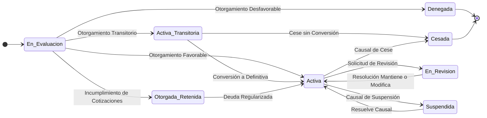

# Resumen Ejecutivo: El Dominio de Prestaciones Económicas

*Propósito: Ofrecer una visión consolidada del dominio de negocio, diseñada para ser accesible tanto para stakeholders estratégicos como para equipos operativos. Este documento traduce el detallado Manual del Dominio Lógico y Operacional (MDLO) en una guía conceptual de alto nivel.*

---

## **Filosofía y Principios Rectores**

Este modelo no es solo una especificación; es la **fuente única de verdad** sobre el negocio de las prestaciones económicas. Se construye sobre cuatro pilares fundamentales que garantizan su robustez y confiabilidad:

-   **Inmutabilidad:** Un hecho de negocio registrado (como un pago o un diagnóstico) no se borra ni se altera. Cualquier cambio crea un nuevo registro versionado, preservando un historial perfecto de todo lo que ha ocurrido.
-   **Auditabilidad:** Cada cálculo, decisión y cambio de estado es un registro fotográfico, inalterable y fechado. El sistema está diseñado para poder responder en cualquier momento a la pregunta: "¿Por qué se pagó este monto en esta fecha?".
-   **Trazabilidad Completa:** Ante una corrección, el sistema no "parcha" datos. Anula el registro original de forma explícita y crea uno nuevo que lo reemplaza, dejando un rastro claro y auditable del cambio.
-   **Gestión de la Evolución Normativa:** El sistema entiende que las leyes cambian. Cada cálculo se ejecuta en el contexto de un `Marco Normativo` (que referencia versiones específicas de parámetros y directivas) para procesar eventos con las reglas exactas de su tiempo.

---

## **Parte 1: El Viaje del Beneficio (La Narrativa del Dominio)**

La historia de cada prestación económica es la historia de una persona. Este modelo captura cada paso de ese viaje, cuyo ciclo de vida se puede visualizar en el siguiente diagrama:

1.  **El Origen: El Hecho Causal**
    Todo comienza con un `HechoCausal`, un evento inesperado en la vida de un trabajador (`Persona`): un accidente laboral, una enfermedad profesional o un lamentable fallecimiento. Este evento es la semilla de la cual puede nacer un derecho.

2.  **La Evaluación y el Nacimiento del Derecho**
    A partir del `HechoCausal`, el sistema evalúa rigurosamente si corresponde un beneficio. Si la evaluación es favorable, nace una `PrestacionEconomica` en estado `En_Evaluacion` que luego transitará a un estado `Activa`, `Denegada` o `Retenida`.

3.  **La Vida del Beneficio: Pagos y Mantenimiento**
    Una vez `Activa`, la prestación genera pagos periódicos. Cada pago se detalla en una `LiquidacionDePago`, un comprobante auditable de cada haber y descuento. Pero un beneficio no es estático; evoluciona con el tiempo.

4.  **Los Hitos del Viaje: Eventos y Cambios**
    Durante su vida, la prestación puede ser alterada por diversos hitos: una reevaluación médica que modifica su monto, un cambio de cuenta bancaria gestionado a través de un `AcuerdoDePago`, o un reajuste anual por el IPC. El modelo está diseñado para manejar estos eventos de forma controlada.

5.  **El Final del Camino: La Suspensión o el Cese**
    Eventualmente, el viaje llega a su fin. La prestación puede ser `Suspendida` temporalmente (ej. por la falta de un certificado de estudios) o `Cesada` de forma definitiva, ya sea por el fallecimiento del beneficiario, por alcanzar la edad de jubilación o por un cambio en su estado civil que extingue el derecho.

6.  **La Realidad: Gobernanza para Casos Complejos**
    El sistema reconoce que no todos los caminos son lineales. Cuando se detecta una inconsistencia que no puede ser resuelta automáticamente (ej. datos históricos contradictorios), se crea un `IncidenteDeDominio`. Esto detiene el proceso para ese caso y lo escala a un equipo de expertos humanos, garantizando que ninguna situación compleja se resuelva sin una supervisión y auditoría adecuadas.

---

## **Parte 2: Las Capacidades Estratégicas del Dominio**

Desde una perspectiva de negocio, el modelo se organiza en cinco capacidades fundamentales que el sistema entrega a la organización.

1.  **Gestión del Ciclo de Vida del Beneficio**
    Es la capacidad central para **crear, mantener, suspender y cesar** cada `PrestacionEconomica`. Se materializa en la máquina de estados del beneficio y en los procesos de Otorgamiento (`PDN-OTG`) y Mantenimiento (`PDN-MANT`), asegurando que cada prestación transite por su ciclo de vida de manera controlada y auditable.

2.  **Motor de Cálculo y Liquidación**
    Es el corazón financiero del sistema. Esta capacidad ejecuta las **Reglas de Negocio (`RDN`)** para calcular con precisión cada línea de una `LiquidacionDePago`. Garantiza que cada pago mensual sea correcto, desde el monto base hasta el último descuento, y que todo sea rastreable hasta una regla específica.

3.  **Cumplimiento Regulatorio y Reportería**
    Actúa como el escudo de cumplimiento de la organización. Su herramienta clave es el **`MarcoNormativo`**, que asegura que cualquier cálculo (actual o retroactivo) se ejecute con los parámetros y directivas vigentes en la fecha aplicable. Además, esta capacidad genera todos los **Informes Regulatorios** (`PDN-REP`) exigidos por entidades como SUSESO y el IPS.

4.  **Gobernanza y Calidad de Datos**
    Esta capacidad provee las herramientas para la intervención experta y la gestión de la calidad. A través de los **Incidentes de Dominio (`EXD`)** y los procesos de gobernanza (`PDN-GOB`), asegura que las excepciones complejas sean manejadas por humanos de forma trazable, manteniendo la integridad y confianza en los datos del sistema.

5.  **Integración con el Ecosistema**
    El sistema no opera en un vacío. Esta capacidad gestiona la comunicación fluida y estandarizada con todas las entidades externas clave, incluyendo el **IPS** (para PGU y beneficios de salud), **SUSESO/SIVEGAM** (para reportes), **Bancos** (para pagos), **PREVIRED** (para cotizaciones) y **SAP** (para contabilidad).

---

## **Parte 3: Preguntas Frecuentes para el Negocio**

### A. Operación Diaria y Gestión de Casos

**P: Un beneficiario llama para actualizar su cuenta bancaria. ¿Cómo se maneja eso?**
**R:** A través de un **`AcuerdoDePago`**. El analista inicia el proceso **`PDN-MANT-009`**, que crea o actualiza el acuerdo y su método de pago asociado en la **`FichaPersona`**, asegurando que el próximo pago se dirija a la nueva cuenta.

**P: ¿Cómo sabe el sistema que un beneficiario de pensión de orfandad sigue estudiando?**
**R:** El sistema lo gestiona proactivamente. Un proceso de monitoreo detecta la proximidad del vencimiento del certificado. Si no se recibe uno nuevo a tiempo, se gatilla un proceso para **suspender** la pensión. Cuando se presenta el certificado, otro proceso la **reactiva**.

**P: Un pensionado falleció la semana pasada. ¿Cómo recuperamos el dinero si ya se pagó el mes completo?**
**R:** Al registrar el fallecimiento, el sistema cesa el beneficio y la regla **`CALC-PLI-010`** determina el monto exacto pagado en exceso. Este monto se registra como una **`Deuda`** a nombre del causante para su posterior recuperación.

### B. Cálculos y Finanzas

**P: ¿De dónde saca el sistema las rentas para calcular el Sueldo Base de un trabajador independiente?**
**R:** Sigue la estrategia definida por el **`MarcoNormativo`** aplicable. Para un independiente obligado, la fuente prioritaria es la información del **Servicio de Impuestos Internos (SII)**, seguida de otras fuentes como cotizaciones directas.

**P: ¿Cómo puedo explicarle a un beneficiario, línea por línea, su liquidación de pago?**
**R:** Cada línea corresponde a un **`ConceptoLiquidacion`** estandarizado en el **`Anexo A`**. Puedes consultar el catálogo para ver la descripción de cada código (ej. `DESC-SALUD-001`) y la regla de negocio (`RDN`) que lo calcula, dándote una explicación precisa.

### C. Casos Complejos, Auditoría y Cumplimiento

**P: Un dictamen de SUSESO nos ordena reliquidar una pensión de hace 3 años. ¿Cómo nos aseguramos de usar las reglas de ese entonces?**
**R:** Esta es la función del **`MarcoNormativo`**. Al procesar el dictamen, el sistema identificará la fecha del siniestro original y seleccionará automáticamente el marco vigente en esa fecha. Todos los cálculos usarán los parámetros y directivas de ese marco histórico.

**P: Un analista cometió un error y otorgó mal un beneficio. ¿Cómo lo corregimos para una auditoría?**
**R:** No se "pisa" el dato. Se inicia un proceso de **reversión** que anula explícitamente la prestación mal otorgada y crea una nueva correcta desde el origen. Todo el proceso queda registrado en el **`ExpedienteDeTramite`**, cumpliendo con los principios de **Inmutabilidad y Trazabilidad**.

**P: Tengo un caso extremadamente raro que el sistema no puede manejar. ¿Cómo pido ayuda experta de forma oficial?**
**R:** El analista debe usar el proceso **`PDN-MANT-017: Solicitar Intervención Manual`**. Esto crea formalmente un **`IncidenteDeDominio`** y lo escala a la bandeja del equipo de Gobernanza. Es el mecanismo oficial para manejar casos que requieren análisis experto.
