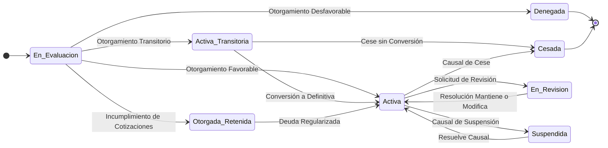

# Manual del Dominio Lógico y Operacional (MDLO) v1.0

Este documento es el punto de entrada principal y la guía de navegación para toda la documentación del Manual del Dominio Lógico y Operacional (MDLO) v1.0.

---

## 1. Guía de Lectura y Estructura del Manual

El MDLO está diseñado como un compendio coherente y secuencial, donde cada capítulo profundiza en un aspecto específico del dominio de prestaciones económicas. Se recomienda seguir la numeración para una comprensión óptima.

### 1.1. El Lenguaje de Modelamiento: Conceptos Fundamentales

Para asegurar una comunicación clara y un entendimiento común, el MDLO utiliza un conjunto de conceptos fundamentales, cada uno con un propósito específico en el negocio:

-   **Proceso de Negocio (PDN):** Un flujo de trabajo completo y de alto nivel (ej. "Otorgamiento de Prestación"). Define el "qué" se hace en el negocio. Su doble clasificación (por categoría de negocio y por etiquetas técnicas) permite entender tanto el *porqué* como el *cómo* se ejecuta.
    -   **Categorías de Negocio (Identificador `PDN-CAT-`):**
        -   **OTG (Otorgamiento):** Iniciar un nuevo beneficio.
        -   **PAG (Pagos):** Liquidar y pagar beneficios.
        -   **MANT (Mantenimiento del Ciclo de Vida):** Gestionar cambios esperados en un beneficio.
        -   **COR (Corrección y Reliquidación):** Rectificar errores o ejecutar dictámenes.
        -   **FIN (Gestión Financiera y Concurrencia):** Administrar flujos de dinero entre instituciones.
        -   **MON (Monitoreo):** Observar condiciones para anticipar o disparar eventos de forma automática.
        -   **REP (Reportería Regulatoria):** Cumplir con obligaciones de información.
    -   **Etiquetas Técnicas:** Describen el comportamiento y requisitos técnicos del proceso (ej. `#scheduled` para procesos programados, `#auditable` para procesos con trazabilidad).

-   **Etapa de Negocio (EDN):** Un paso específico dentro de un Proceso de Negocio. Permite desglosar flujos complejos en tareas manejables y auditar el progreso.
-   **Regla de Negocio (RDN):** La lógica atómica y los criterios fundamentales que gobiernan el comportamiento del sistema. Asegura que los cálculos y decisiones sean consistentes, correctos y cumplan con la normativa.
-   **Evento de Negocio (EVT):** Un suceso significativo (interno o externo) que ocurre y que requiere una respuesta o acción por parte del sistema. Permite que el sistema reaccione de forma proactiva a cambios en el entorno o en la vida del beneficiario.
-   **Excepción de Proceso (EXP):** Una desviación del flujo normal que está contemplada en la normativa y tiene un manejo predefinido. Permite al sistema gestionar situaciones atípicas sin detener la operación.
-   **Excepción de Dominio (EXD):** Una inconsistencia o violación de reglas fundamentales que el sistema detecta y que requiere la intervención de un experto humano para su resolución. Garantiza la integridad de los datos y la correcta gestión de casos complejos.
-   **Marco Normativo:** Unidad coherente y versionada que referencia parámetros normativos y directivas de ejecución para un período de vigencia específico. Asegura que todos los cálculos (actuales o retroactivos) se realicen con la normativa correcta de su tiempo, garantizando la auditabilidad y el cumplimiento legal.

### 1.2. El Modelo de Dominio: Entidades Clave (Visión General)

*Propósito: Introducir las entidades de negocio más importantes y sus relaciones a un alto nivel. Comprender estas entidades es fundamental para entender cómo se organiza y gestiona la información clave del negocio. El detalle exhaustivo de cada entidad se encuentra en el **Capítulo 04: Modelo de Entidades**.*

-   **`Persona`**: Representa a un individuo único (RUT, nombre).
-   **`FichaPersona`**: Carpeta maestra 360° que agrupa toda la interacción de una `Persona` con el sistema.
-   **`HechoCausal`**: Evento gatillador (accidente, enfermedad) que da origen a las prestaciones.
-   **`PrestacionEconomica`**: Derecho específico e individual (Pensión, Indemnización) que resulta de un HechoCausal.
-   **`AcuerdoDePago`**: Entidad central que modela cualquier acuerdo que altere un pago (apoderados, retenciones, descuentos).
-   **`LiquidacionDePago`**: Comprobante de pago mensual o puntual, compuesto por `ConceptoLiquidacion`.
-   **`ExpedienteDeTramite`**: Contenedor auditable del proceso de gestión de un `HechoCausal` o `Tramite`.
-   **`Tramite`**: Generaliza cualquier solicitud o petición formal que inicia un proceso (ej. una revisión, una apelación).

### 1.3. El Ciclo de Vida Central: Máquina de Estados de la `PrestacionEconomica`

*Propósito: Modelar los estados y transiciones principales de un beneficio. Comprender este ciclo es crucial para entender el flujo de vida de una prestación, desde su origen hasta su cese, y cómo el sistema gestiona cada etapa. La tabla de transiciones detallada se encuentra en el **Capítulo 04: Modelo de Entidades**.*

### 1.4. Cómo Navegar este Manual (Para el Negocio)

Este manual está diseñado para ser una referencia completa. Aquí te sugerimos cómo abordarlo según tu rol o interés:

*   **Para una Visión General y Estratégica:** Comienza con el **[01_Resumen_Ejecutivo.md](./01_Resumen_Ejecutivo.md)**. Te dará una perspectiva de alto nivel sin entrar en detalles técnicos.

*   **Para Analistas de Negocio y Procesos:** Después del resumen, concéntrate en los capítulos:
    *   **[03_Glosario_y_Catalogos.md](./03_Glosario_y_Catalogos.md)**: Para entender la terminología y los valores permitidos.
    *   **[04_Modelo_de_Entidades.md](./04_Modelo_de_Entidades.md)**: Para comprender la estructura de los datos del negocio.
    *   **[05_Procesos_de_Negocio.md](./05_Procesos_de_Negocio.md)**: Para ver los flujos de trabajo operativos.
    *   **[06_Reglas_de_Negocio.md](./06_Reglas_de_Negocio.md)**: Para conocer la lógica de cálculo y validación.

*   **Para Auditores y Equipos de Cumplimiento:** Presta especial atención a los capítulos:
    *   **[09_Escenarios_de_Verificacion.md](./09_Escenarios_de_Verificacion.md)**: Para entender cómo se valida el sistema.
    *   **[10_Gobernanza_de_Excepciones.md](./10_Gobernanza_de_Excepciones.md)**: Para comprender cómo se gestionan los casos complejos y las inconsistencias.
    *   **[11_Informes_Regulatorios.md](./11_Informes_Regulatorios.md)**: Para revisar las obligaciones de reportería.
    *   **[12_Versionamiento_Normativo_y_Resolucion.md](./12_Versionamiento_Normativo_y_Resolucion.md)**: Para verificar la aplicación de la normativa histórica.

*   **Para Equipos de Integración y TI:** Además de los capítulos de Entidades y Reglas, consulta:
    *   **[07_Interfaces_Externas.md](./07_Interfaces_Externas.md)**: Para las especificaciones de comunicación con otros sistemas.
    *   **[13_Matriz_de_Trazabilidad.md](./13_Matriz_de_Trazabilidad.md)**: Para entender las dependencias entre procesos y reglas.

---

## 2. Modelo de Operación y Gobernanza Humana

*Propósito: Describir cómo los equipos humanos interactúan, gobiernan y gestionan el sistema.*

### 2.1. Gobernanza y Puntos de Control Humano (`VERF`)

-   **Concepto:** Pausa diseñada en un proceso automático para requerir la aprobación de un rol de usuario autorizado.
-   **Formulario de Verificación Manual (FVM):** Interfaz que presenta al supervisor el contexto del caso, la evidencia y las acciones de decisión (Aprobar, Rechazar, Devolver).

### 2.2. Gestión de Tareas y Priorización (IPT)

-   **Índice de Prioridad de Tarea (IPT):** Métrica dinámica que ordena las tareas en las bandejas de los usuarios, asegurando que los casos más críticos se atiendan primero. Esto optimiza la eficiencia operativa y el cumplimiento de plazos.

### 2.3. Gestión Proactiva y Comunicaciones

-   **Monitores de Eventos Futuros:** Procesos de monitoreo (`PDN-MON`) que identifican hitos importantes en el ciclo de vida de un beneficiario (ej. proximidad a cese por edad) para gatillar comunicaciones preventivas.
-   **Rol del Gestor de FichaPersona:** Rol humano de acompañamiento que utiliza las alertas de los monitores para contactar y asistir a los beneficiarios.

---

## 3. Índice Detallado de Capítulos

Este índice proporciona acceso directo a cada sección del Manual del Dominio Lógico y Operacional.

1.  **[01_Resumen_Ejecutivo.md](./01_Resumen_Ejecutivo.md)**
    *   Ofrece una visión consolidada del dominio de negocio, diseñada para ser accesible tanto para stakeholders estratégicos como para equipos operativos.

2.  **[02_Indice_y_Guia_de_Lectura.md](./02_Indice_y_Guia_de_Lectura.md)**
    *   Este documento: el punto de entrada principal y la guía de navegación para toda la documentación del MDLO.

3.  **[03_Glosario_y_Catalogos.md](./03_Glosario_y_Catalogos.md)**
    *   Define el lenguaje común y las listas de valores clave del negocio, asegurando la consistencia de los datos y la comunicación entre todos los equipos.

4.  **[04_Modelo_de_Entidades.md](./04_Modelo_de_Entidades.md)**
    *   Detalla la estructura de la información central del negocio (ej. Persona, Prestación Económica), mostrando cómo se organizan los datos y sus relaciones para una gestión eficiente.

5.  **[05_Procesos_de_Negocio.md](./05_Procesos_de_Negocio.md)**
    *   Describe los flujos de trabajo operativos clave del negocio, desde el otorgamiento de beneficios hasta los pagos, explicando el 'qué' y el 'porqué' de cada actividad.

6.  **[06_Reglas_de_Negocio.md](./06_Reglas_de_Negocio.md)**
    *   Explica la lógica de cálculo y validación que asegura la correcta aplicación de la normativa y la consistencia en todas las decisiones del sistema.

7.  **[07_Interfaces_Externas.md](./07_Interfaces_Externas.md)**
    *   Detalla cómo el sistema se comunica e intercambia información con otras instituciones clave (ej. IPS, SUSESO, Bancos), garantizando la fluidez de las operaciones.

8.  **[08_Eventos_y_Excepciones.md](./08_Eventos_y_Excepciones.md)**
    *   Identifica los sucesos que inician procesos (Eventos) y las desviaciones o errores esperados (Excepciones), mostrando cómo el sistema reacciona y gestiona situaciones atípicas.

9.  **[09_Escenarios_de_Verificacion.md](./09_Escenarios_de_Verificacion.md)**
    *   Presenta los casos de prueba y escenarios de negocio clave que validan el correcto funcionamiento del sistema, asegurando que cumple con las expectativas y la normativa.

10. **[10_Gobernanza_de_Excepciones.md](./10_Gobernanza_de_Excepciones.md)**
    *   Describe el proceso para gestionar y resolver casos complejos o inconsistencias que requieren intervención humana experta, garantizando la integridad y confianza en los datos.

11. **[11_Informes_Regulatorios.md](./11_Informes_Regulatorios.md)**
    *   Detalla todos los informes y notificaciones obligatorias que el sistema genera para cumplir con las exigencias de los entes reguladores (ej. SUSESO, IPS).

12. **[12_Versionamiento_Normativo_y_Resolucion.md](./12_Versionamiento_Normativo_y_Resolucion.md)**
    *   Capítulo consolidado que define el modelo de versionamiento (`MarcoNormativo`, `ParametrosNormativos`, `DirectivaDeEjecucion`), su arquitectura de resolución, matrices, gobernanza y cronología de marcos.

13. **[13_Matriz_de_Trazabilidad.md](./13_Matriz_de_Trazabilidad.md)**
    *   Muestra de forma visual las dependencias entre los procesos de negocio y las reglas que los sustentan, facilitando el análisis de impacto y la comprensión de la lógica operativa.

14. (Reservado para futuras extensiones)
