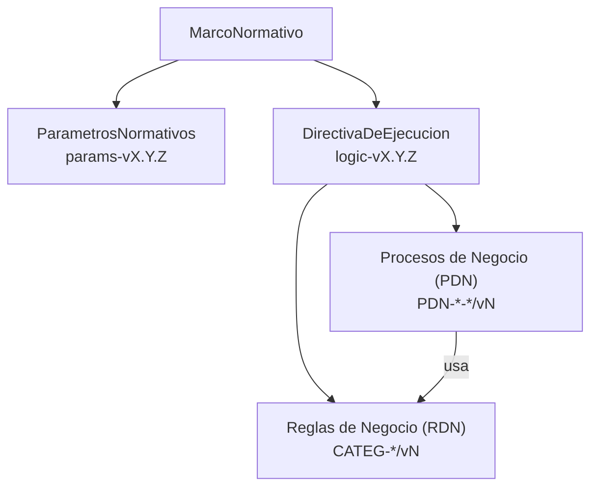

# Anexo B: Entidades de Dominio

*Propósito: Describir en detalle cada una de las entidades del modelo de dominio, sus atributos clave y sus relaciones con otras entidades. Este anexo es la especificación canónica para la estructura de datos del sistema.*

---

## 1. Entidades Principales

### 1.1. `Persona`
- **Descripción:** Representa a un individuo único en el sistema, identificado por su RUT. Es la fuente única de verdad para los datos demográficos y de contacto.
- **Atributos Clave:** `ID`, `RUT`, `NombreCompleto`, `FechaNacimiento`, `Sexo`, `EstadoCivil`, `FechaDefuncion`, `Direccion`, `Telefono`, `Email`.
- **Relaciones:** Una `Persona` puede tener una `FichaPersona`.

### 1.2. `FichaPersona`
- **Descripción:** La carpeta maestra 360° de una `Persona` en el contexto de las prestaciones económicas. Agrupa todos los roles, trámites, beneficios y afiliaciones de un individuo.
- **Atributos Clave:** `ID`, `PersonaID`, `AfiliacionAFP`, `TasaCotizacionAFP`, `AfiliacionSalud`, `PlanSalud`, `MontoPlanSalud`, `PagaAguinaldo`, `PagaBonoInvierno`.
- **Relaciones:** Agrega N `PrestacionEconomica`, N `AcuerdoDePago`, N `Tramite`, N `CausanteAsignacionFamiliar`, N `BeneficioPrevisionalExterno`.

### 1.3. `HechoCausal`
- **Descripción:** Representa el evento único (siniestro) que gatilla la evaluación y posible otorgamiento de prestaciones. Su origen es una denuncia oficial (DIAT/DIEP).
- **Atributos Clave:** `ID`, `TipoSiniestro`, `FechaSiniestro`, `TrabajadorID`, `SISESAT_Folio`.
- **Relaciones:** Origina N `PrestacionEconomica`, se gestiona a través de un `ExpedienteDeTramite`.

> Nota sobre identificadores: `SISESAT_Folio` es un identificador externo provisto por el sistema SISESAT asociado a la denuncia o gestión del siniestro. No sustituye al identificador maestro de gestión interna del caso, que es el `CUN` del `ExpedienteDeTramite`. El sistema debe mantener la trazabilidad entre `SISESAT_Folio` y `CUN` a través de la relación `HechoCausal` → `ExpedienteDeTramite`.

### 1.4. `PrestacionEconomica`
- **Descripción:** El derecho específico e individual a un beneficio económico. Cada beneficiario (titular o sobreviviente) tiene su propia instancia de esta entidad.
- **Atributos Clave:** `ID`, `HechoCausalID`, `FichaPersonaID`, `Tipo`, `Estado`, `CodigoInactivacion`, `MontoBase`, `esVitalicia`, `FechaActivacion`, `FechaFinVigencia`, `FechaFinVigenciaTeorico`.
- **Relaciones:** Pertenece a una `FichaPersona`, se origina de un `HechoCausal`, genera N `LiquidacionDePago`.

> Aclaración de vigencias: `FechaFinVigencia` registra la fecha efectiva en que cesa el derecho y deja de generar pagos. `FechaFinVigenciaTeorico` almacena la fecha en que el beneficio habría cesado bajo la regla general si no operara una condición de prórroga o transformación (por ejemplo, una pensión transitoria que se convierte en definitiva, o una viudez que extiende su vigencia al cumplir una edad/condición). Ambas fechas permiten auditar escenarios condicionales y reliquidaciones.

### 1.5. `LiquidacionDePago`
- **Descripción:** Comprobante auditable y detallado que desglosa todos los haberes y descuentos para un período de pago específico.
- **Atributos Clave:** `ID`, `PrestacionID`, `Periodo`, `MontoImponible`, `TotalHaberes`, `TotalDescuentos`, `MontoLiquido`.
- **Relaciones:** Pertenece a una `PrestacionEconomica`, se compone de N `ConceptoLiquidacion`.

---

## 2. Entidades de Acuerdos y Pagos (Modelo Centralizado)

### 2.1. `AcuerdoDePago`
- **Descripción:** Entidad central que modela cualquier acuerdo formal que altere el destino, la composición o el método de pago de una `PrestacionEconomica`.
- **Atributos Clave:** `ID`, `PrestacionID`, `FichaPersonaCobradorID`, `TipoAcuerdo`, `Estado`, `FechaInicioVigencia`, `FechaFinVigencia`, `Prioridad`, `DocumentoRespaldoID`.
- **Relaciones:** Se asocia a una `PrestacionEconomica`, tiene un `MetodoDePago` y opcionalmente una `ConfiguracionDescuento`.

### 2.2. `MetodoDePago`
- **Descripción:** Almacena la información bancaria y de destino para un `AcuerdoDePago`.
- **Atributos Clave:** `ID`, `TipoDestino` (Nacional/Extranjero), `BancoCodigo`, `NumeroCuenta`, `TipoCuenta`, `Moneda`, `SwiftBIC`.
- **Relaciones:** Es parte de un `AcuerdoDePago`.

### 2.3. `ConfiguracionDescuento`
- **Descripción:** Almacena los parámetros de cálculo para un `AcuerdoDePago` de tipo retención o descuento programado.
- **Atributos Clave:** `ID`, `TipoCalculo` (Porcentaje/MontoFijo), `Valor`, `BaseDeCalculo` (Imponible/Líquido), `FormaDePago` (Completo/Cuotas), `MontoInicialTotal`, `CuotasIniciales`, `SaldoPendiente`.
- **Relaciones:** Es parte de un `AcuerdoDePago`.

---

## 3. Entidades de Cálculo y Contabilidad

### 3.1. `CalculoSueldoBase`
- **Descripción:** Resultado auditable del cálculo del sueldo base para un `HechoCausal`.
- **Atributos Clave:** `ID`, `HechoCausalID`, `FechaCalculo`, `MontoResultado`, `MarcoNormativo_ID`.

### 3.2. `ConceptoLiquidacion`
- **Descripción:** Representa una línea de haber o descuento individual dentro de una `LiquidacionDePago`.
- **Atributos Clave:** `ID`, `CodigoConcepto`, `DescripcionConcepto`, `Monto`, `Tipo` (Haber/Descuento), `CodigoContableSAP`, `OrigenConceptoID`.

### 3.3. `ComprobanteContable`
- **Descripción:** Artefacto que agrupa y totaliza los `ConceptoLiquidacion` por cuenta contable para la integración con SAP.
- **Atributos Clave:** `ID`, `Periodo`, `FechaGeneracion`, `Estado`, `LineasContables`.

### 3.4. `CapitalRepresentativo`
- **Descripción:** Modela el resultado del cálculo del capital representativo para una `PrestacionEconomica` en una fecha determinada, clave para reportería.
- **Atributos Clave:** `ID`, `PrestacionID`, `FechaCalculo`, `CapitalTotal`, `MarcoNormativo_ID`.

### 3.5. `AjusteManualLiquidacion`
- **Descripción:** Modela un haber o descuento ingresado manualmente por un analista, que no se origina en una regla de cálculo automática.
- **Atributos Clave:** `ID`, `FichaPersonaID`, `TipoAjuste`, `MontoTotal`, `FormaDescuento` (Total/Cuotas), `NumeroCuotas`, `Estado`.

### 3.6. `Deuda`
- **Descripción:** Entidad centralizada para modelar, gestionar y auditar las obligaciones de una persona con la mutualidad.
- **Atributos Clave:** `ID`, `FichaPersonaID`, `TipoDeuda` (Reversión, Préstamo, Cotizaciones), `MontoOriginal`, `SaldoPendiente`, `Estado` (Activa, Saldada, Condonada), `PlanDePagoID` (referencia a un plan de cuotas).

---

## 4. Entidades de Soporte y Relacionales

### 4.1. `Trabajador`
- **Descripción:** El rol que una `Persona` asume al originar un derecho.
- **Atributos Clave:** `ID`, `PersonaID`, `TipoContrato`.

### 4.2. `CausanteAsignacionFamiliar`
- **Descripción:** Representa a una "carga" familiar reconocida para un beneficiario.
- **Atributos Clave:** `ID`, `FichaPersonaID`, `RUT_Causante`, `EstadoInterno`, `EstadoSIVEGAM`, `FechaUltimaSincronizacion`.

### 4.3. `Empleador`
- **Descripción:** Representa a la entidad para la cual el trabajador presta o prestó servicios.
- **Atributos Clave:** `ID`, `RUT_Empleador`, `RazonSocial`.

### 4.4. `HistorialAfiliacion`
- **Descripción:** Registra los períodos de afiliación de un trabajador en los distintos organismos administradores.
- **Atributos Clave:** `ID`, `FichaPersonaID`, `OrganismoID`, `FechaInicio`, `FechaFin`.

### 4.5. `BeneficioPrevisionalExterno`
- **Descripción:** Registra un beneficio que una `Persona` recibe de otra institución (ej. AFP, IPS), información clave para determinar compatibilidades.
- **Atributos Clave:** `ID`, `FichaPersonaID`, `OrganismoID`, `TipoBeneficio`, `MontoBeneficio`.

---

## 5. Entidades de Trámite y Comunicación

### 5.1. `ExpedienteDeTramite`
- **Descripción:** Contenedor auditable del proceso de gestión de un `HechoCausal` o `Tramite`.
- **Atributos Clave:** `ID`, `HechoCausalID`, `TramiteID`, `CUN`, `Estado`.

> Nota sobre identificadores: `CUN` es el Código Único Nacional y actúa como identificador maestro del expediente/caso dentro del sistema. Se debe registrar el mapeo con identificadores externos como `SISESAT_Folio` del `HechoCausal` para asegurar la trazabilidad inter-sistemas.

### 5.2. `Tramite`
- **Descripción:** Generaliza cualquier solicitud o petición formal que inicia un proceso.
- **Atributos Clave:** `ID`, `FichaPersonaID`, `TipoTramite` (Revision, Apelacion, Exportacion, Concurrencia, etc.), `Estado`, `FechaCreacion`.

### 5.3. `DocumentoAdjunto`
- **Descripción:** Evidencia documental (REIP, certificados) asociada a un `ExpedienteDeTramite`.
- **Atributos Clave:** `ID`, `ExpedienteID`, `TipoDocumento`, `URLAlmacenamiento`.

### 5.4. `GestionDeContacto`
- **Descripción:** Modela un intento de comunicación específico realizado para un `ExpedienteDeTramite`.
- **Atributos Clave:** `ID`, `ExpedienteID`, `MedioDeContacto`, `Resultado`.
> Reglas asociadas: la creación de una `GestionDeContacto` puede ser obligatoria cuando vencen plazos normativos sin recepción de documentos (ver **`CUMP-OTG-004`** y **`COMM-OTG-005`**).

### 5.5. `ResolucionRegulador`
- **Descripción:** Dictamen o resolución oficial y vinculante recibido de un ente regulador.
- **Atributos Clave:** `ID`, `ExpedienteID`, `OrganismoEmisor`, `NumeroDictamen`, `InstruccionDetallada`.

### 5.6. `InformeRegulatorio`
- **Descripción:** Informe oficial generado por el sistema y enviado a un ente regulador.
- **Atributos Clave:** `ID`, `TipoInforme`, `OrganismoDestino`, `PeriodoInformado`, `EstadoEnvio`.

### 5.7. `ReembolsoAEmpleador`
- **Descripción:** Registro auditable de un reembolso realizado a una entidad empleadora.
- **Atributos Clave:** `ID`, `ExpedienteID`, `EmpleadorID`, `MontoReembolso`, `EstadoReembolso`.

---

## 6. Entidades de Gobernanza y Excepciones

*La gestión de excepciones y los casos que requieren intervención manual se gobiernan a través de un proceso formal y auditable descrito en el capítulo **10_Gobernanza_de_Excepciones.md**. La entidad principal que modela estos casos es el `IncidenteDeDominio`.*

*Para una definición detallada de la entidad `IncidenteDeDominio`, sus atributos, máquina de estados y el proceso de negocio asociado, refiérase a la sección 18.2 del capítulo 10.*

---

## 7. Subcapítulo: `MarcoNormativo` y Ensamblaje de Lógica

**Propósito:** Incorporar la perspectiva conceptual de cómo el sistema compone la lógica y parámetros de negocio bajo un `MarcoNormativo`.

- `MarcoNormativo`: referencia `ParametrosNormativos (params-vX.Y.Z)` y `DirectivaDeEjecucion (logic-vX.Y.Z)` con un período de `Vigencia`.
- `DirectivaDeEjecucion`: mapea `PDN`/`RDN` → `vN`.

Diagrama de relaciones:

Para la arquitectura de resolución, casos de uso y matrices, ver el capítulo `12_Versionamiento_Normativo_y_Resolucion.md`.

---

## 8. Comportamiento Dinámico: Máquinas de Estado

Esta sección detalla el comportamiento dinámico de las entidades clave a través de máquinas de estado formales.

### 8.1. Máquina de Estados de `PrestacionEconomica`

| Estado Origen | Evento Gatillador (EVT) | Condición de Guarda (RDN) | Acciones a Ejecutar (PDN) | Estado Destino |
| :--- | :--- | :--- | :--- | :--- |
| `[*] `| `EVT-OTG-001` (Recepción REIP) | - | `PDN-OTG-002` | `En_Evaluacion` |
| `En_Evaluacion` | Decisión Favorable | `VALID-OTG-001` es **true** | `PDN-OTG-002` | `Activa` |
| `En_Evaluacion` | Decisión Favorable | `VALID-OTG-001` es **false** | `PDN-OTG-002` | `Otorgada_Retenida` |
| `En_Evaluacion` | Decisión Desfavorable | - | `PDN-OTG-003` | `Denegada` |
| `En_Evaluacion` | `EVT-CICLO-005` (Límite de subsidio) | `VALID-OTG-002` es **true** | `PDN-OTG-004` | `Activa_Transitoria` |
| `Activa_Transitoria` | Evaluación favorable | - | `PDN-MANT-019` | `Activa` |
| `Activa_Transitoria` | Evaluación desfavorable | - | `PDN-MANT-020` | `Cesada` |
| `Activa` | `EVT-MANT-002` (Solicitud Revisión) | - | Registrar `Tramite` de revisión | `En_Revision` |
| `En_Revision` | `EVT-EXT-001` (Resolución) | - | `PDN-COR-002` | `Activa` |
| `Activa` | `EVT-CICLO-004` (Vence plazo estudios) | `Beneficiario.Rol = HIJO_ESTUDIANTE` | `PDN-MANT-002` | `Suspendida` |
| `Suspendida` | `EVT-CICLO-003` (Recibe cert. estudios) | `CodigoInactivacion` es por estudios | `PDN-MANT-003` | `Activa` |
| `Activa` | `EVT-CICLO-001` (Cumple edad vejez) | `Prestacion.esVitalicia = false` | `PDN-MANT-001` | `Cesada` |
| `Activa` | `EVT-CICLO-002` (Nuevo vínculo) | `Beneficiario.Rol IN (CONYUGE, CONVIVIENTE_CIVIL)` | `PDN-MANT-010` | `Cesada` |
| `Activa` | `EVT-CICLO-006` (Fallecimiento) | - | `PDN-MANT-012` (si aplica) | `Cesada` |

### 8.2. Máquina de Estados de `ExpedienteDeTramite`

| Estado Origen | Evento Gatillador | Condición de Guarda | Acciones a Ejecutar | Estado Destino |
| :--- | :--- | :--- | :--- | :--- |
| `[*] `| Creación de Expediente | - | - | `Abierto - Recopilando Antecedentes` |
| `Abierto - Recopilando Antecedentes` | Solicitud de docs a 3ros | - | Registrar `GestionDeContacto` | `En Pausa - Pendiente de Terceros` |
| `En Pausa - Pendiente de Terceros` | Recepción de docs | - | Validar completitud | `Abierto - Recopilando Antecedentes` |
| `Abierto - Recopilando Antecedentes` | `Expediente completo` | - | Notificar a analista | `Completo - Listo para Resolución` |
| `Completo - Listo para Resolución` | Resolución de prestación | - | Archivar | `Cerrado - Resuelto` |