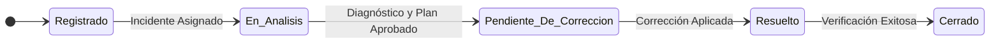

# Anexo H: Gobernanza de Excepciones y Casos Críticos

*Propósito: Establecer un marco de trabajo formal, auditable y trazable para la identificación, análisis y resolución de Excepciones de Dominio (EXD). Este capítulo define el proceso y las responsabilidades para manejar inconsistencias de datos o lógica que requieren juicio experto y que no pueden ser resueltas por los flujos de proceso estándar.*

## **18. Gobernanza de Excepciones de Dominio (EXD)****

### **18.1. Propósito y Principios**

Una Excepción de Dominio (EXD) representa una inconsistencia fundamental que el sistema detecta pero no puede resolver automáticamente. La gobernanza de EXD no es un camino alternativo del proceso, sino un protocolo de detención y escalamiento para asegurar una resolución correcta y auditable.

**Principios Rectores:**

  - **Visibilidad Total:** Toda EXD genera un `IncidenteDeDominio` formal. No existen las correcciones informales o "por base de datos".
  - **Trazabilidad Inmutable:** La detección, el análisis, la solución aplicada y el responsable quedan registrados de forma inalterable.
  - **Resolución por Expertos:** Los incidentes son asignados a un equipo especializado (Gobernanza de Datos o Analistas Expertos) con profundo conocimiento del dominio y la normativa.
  - **Priorización Basada en Riesgo:** Los incidentes se priorizan utilizando el Índice de Prioridad de Tarea (IPT) para atender primero los casos de mayor impacto financiero, legal o de cumplimiento.
  - **Fuente de Mejora Continua:** Cada EXD resuelta es una oportunidad de aprendizaje. Su resolución debe nutrir una base de conocimiento y, si aplica, generar requerimientos para mejorar las reglas del sistema y prevenir futuras excepciones.

### **18.2. Entidad Clave: `IncidenteDeDominio`**

Para gestionar las EXD, se introduce una nueva entidad en el modelo de dominio.

  - **`IncidenteDeDominio`**:
      - **Descripción:** Modela el registro único y auditable de una Excepción de Dominio detectada por el sistema. Centraliza toda la gestión del caso desde su detección hasta su cierre.
      - **Atributos:**
          - `ID: UUID`
          - `CodigoEXD: String` (Ej. `EXD-DATOS-002`)
          - `FichaPersonaID: Ref` (Referencia a la ficha afectada)
          - `ExpedienteID: Ref?` (Referencia al expediente específico, si aplica)
          - `Estado: Enum(Registrado, En_Analisis, Pendiente_De_Correccion, Resuelto, Cerrado)`
          - `FechaDeteccion: DateTime`
          - `DescripcionSistema: String` (Mensaje técnico generado por el sistema sobre el error)
          - `AnalistaAsignadoID: Ref?`
          - `DiagnosticoAnalista: String` (Análisis de la causa raíz por el experto)
          - `PlanDeAccion: String` (Descripción de la solución a aplicar)
          - `FechaResolucion: DateTime?`
          - `PrioridadIPT: Integer`
      - **Relaciones:**
          - **Asociación:** Se asocia a una `FichaPersona`.
          - **Asociación:** Puede estar vinculado a un `ExpedienteDeTramite` específico.
          - **Agregación:** Agrega N `GestionDeContacto` si se requiere contactar a externos para su resolución.

### **18.3. Máquina de Estados del `IncidenteDeDominio`**

El ciclo de vida de un incidente sigue un flujo de estados estrictamente controlado.

**Tabla de Transiciones Formales:**

| Estado Origen | Evento Gatillador | Acciones a Ejecutar | Estado Destino |
| :--- | :--- | :--- | :--- |
| ` [*]  ` | Detección de EXD | Crear `IncidenteDeDominio`, Pausar Proceso Original, Calcular `IPT` | `Registrado` |
| `Registrado` | Asignación a Analista | Asignar `AnalistaAsignadoID` | `En_Analisis` |
| `En_Analisis` | Aprobación de Plan de Acción | `VERF-GOB-001` es aprobada | `Pendiente_De_Correccion` |
| `Pendiente_De_Correccion` | Ejecución de Acción Correctiva | Aplicar corrección (manual o sistémica) | `Resuelto` |
| `Resuelto` | Re-ejecución exitosa del proceso original | Registrar evidencia de éxito, notificar | `Cerrado` |

### **18.4. Proceso de Negocio: `PDN-GOB-001`**

Se define un proceso de negocio específico para la gobernanza.

  - **PDN-GOB-001: Gestión y Resolución de Incidentes de Dominio**
      - **Descripción:** Flujo de trabajo que se activa cuando una regla de negocio fundamental es violada y el sistema no puede continuar. Orquesta la intervención humana para diagnosticar, resolver y auditar la corrección de la excepción.
      - **Etiquetas Técnicas:** `#event-driven`, `#human-in-the-loop`, `#auditable`
      - **Etapas (EDN):**
        1.  `EDN-GOB-001: Detección y Creación de Incidente`: Un proceso (ej. `PDN-OTG-001`) falla al evaluar una regla crítica, **o un usuario inicia el proceso `PDN-MANT-017` para solicitar una intervención manual**. El sistema detiene la operación para ese caso (si aplica), crea una instancia de `IncidenteDeDominio` en estado `Registrado` y la ingresa a una bandeja de tareas de alta prioridad.
        2.  `EDN-GOB-002: Triage y Asignación`: Un `Líder de Equipo de Gobernanza` revisa el incidente, confirma su prioridad (basada en el `IPT`) y lo asigna a un `Analista Experto de Dominio`. El estado cambia a `En_Analisis`.
        3.  `EDN-GOB-003: Análisis y Diagnóstico`: El analista investiga la causa raíz del problema, utilizando todas las herramientas y datos disponibles en la `FichaPersona`. Registra su `DiagnosticoAnalista`.
        4.  `EDN-GOB-004: Propuesta y Aprobación de Solución`: El analista define un `PlanDeAccion` (ej. "Corregir manualmente la renta del mes X", "Solicitar a TI la anulación del documento Y"). Este plan debe ser aprobado mediante la regla **`VERF-GOB-001`**. Tras la aprobación, el estado cambia a `Pendiente_De_Correccion`.
        5.  `EDN-GOB-005: Ejecución de la Corrección`: El analista ejecuta el plan de acción aprobado. La acción (ej. un ajuste de datos) debe dejar un rastro de auditoría explícito, vinculando el cambio al `IncidenteDeDominio`. El estado cambia a `Resuelto`.
        6.  `EDN-GOB-006: Verificación y Cierre`: El analista reanuda el proceso de negocio original que falló. Si se ejecuta correctamente, el `IncidenteDeDominio` se mueve al estado `Cerrado`. Si falla de nuevo, vuelve a `En_Analisis` para una nueva investigación.

### **18.5. Reglas de Verificación Humana Asociadas (VERF)**

| ID de la Regla | Nombre Descriptivo | Proceso de Negocio Asociado (PDN) | Descripción y Criterios de Verificación | Rol de Usuario Autorizado |
| :--- | :--- | :--- | :--- | :--- |
| **`VERF-GOB-001`** | Aprobación de Plan de Acción para Incidente de Dominio | `PDN-GOB-001` | **Disparador:** Cuando el analista ha completado el diagnóstico y propone una solución.   **Criterios:** El supervisor debe validar que el diagnóstico es coherente con la evidencia y que el plan de acción es seguro, normativamente correcto y es la solución idónea. Debe evaluar el riesgo de la acción propuesta antes de autorizar su ejecución. | `Líder de Equipo de Gobernanza` / `Comité de Excepciones` |

### **18.6. Catálogo de Excepciones de Dominio (EXD) - Expandido**

Este catálogo debe ser mantenido y actualizado a medida que el sistema evoluciona. Proporciona una base de conocimiento para el equipo de Gobernanza.

| ID de la Excepción | Nombre Descriptivo | Descripción Técnica | Impacto Potencial | Sugerencia de Solución Preliminar |
| :--- | :--- | :--- | :--- | :--- |
| **`EXD-DATOS-001`** | Corrección Retroactiva de Datos Previsionales | Un dato previsional clave (ej. remuneración) fue ingresado incorrectamente en el pasado y requiere una corrección que invalida cálculos ya realizados. | **Alto.** Puede generar pagos incorrectos, deudas o reliquidaciones masivas. Riesgo de cumplimiento y financiero. | Escalar a `Líder de Gobernanza`. Requiere un proceso de `PDN-COR-001` para recalcular y ajustar retroactivamente, posiblemente generando una `Deuda`. |
| | **`EXD-DATOS-002`** | Historial de Rentas Insuficiente | No se encuentra el mínimo de meses de remuneraciones/rentas requeridos por el `MarcoNormativo` para calcular un Sueldo Base, y las reglas de contingencia no aplican. | **Crítico.** Bloquea el otorgamiento de un beneficio. Incumplimiento de plazos legales (`CUMP-OTG-*`). | Escalar a `Analista Experto`. Investigar fuentes alternativas (contratos, finiquitos, SII). Si no se encuentran datos, proceder con `PDN-OTG-003: Denegación`. |
| **`EXD-INTEGRIDAD-001`** | Violación de Unicidad de Prestación Activa | El sistema intenta crear una nueva `PrestacionEconomica` (ej. Pensión) para un `HechoCausal` que ya tiene una prestación `Activa` del mismo tipo. | **Medio.** No hay impacto financiero directo, pero indica un posible error en un proceso o una solicitud duplicada. | El sistema debe rechazar la creación automáticamente. Registrar el incidente para análisis de causa raíz (¿error de interfaz, fallo en proceso previo?). |
| **`EXD-INTEGRIDAD-002`** | Orfandad de Referencia en Liquidación | Se intenta crear una `LiquidacionDePago` para una `PrestacionEconomica` que ha sido anulada o no existe. | **Bajo.** Error de sistema, probablemente por una condición de carrera o un bug. No debería ocurrir en un sistema transaccional robusto. | El proceso de pago para ese individuo debe fallar limpiamente. Registrar el incidente para investigación técnica. No requiere intervención de negocio. |
| **`EXD-LOGICA-001`** | Inconsistencia en Cálculo de Concurrencia | En una enfermedad profesional, la suma de los porcentajes de prorrata calculados para todos los organismos administradores no es igual al 100%. | **Alto.** Impide el pago correcto de una pensión compartida. Riesgo financiero y de disputa con otros organismos. | Detener el pago de la prestación. Escalar a `Analista Experto` para contactar a los otros organismos, recalcular las prorratas (`CALC-FIN-001`) y formalizar el acuerdo. |
| **`EXD-CICLOVIDA-001`** | Transición de Estado Inválida Detectada | Un evento externo o proceso intenta forzar una transición de estado en la `PrestacionEconomica` que viola la máquina de estados definida. | **Medio.** Indica una inconsistencia lógica o un evento inesperado. Podría llevar a un estado de datos corrupto si no se maneja. | El sistema debe rechazar la transición. Registrar el incidente. Analizar el evento gatillador para entender por qué se intentó una transición ilegal. |
| **`EXD-NORMA-001`** | Escenario Normativo No Soportado | Se presenta un caso cuyas características (ej. fecha de siniestro muy antigua) no corresponden a ningún `MarcoNormativo` cargado. | **Crítico.** El sistema no puede procesar el caso. Imposibilidad de cumplir con la ley para ese individulo. | Escalar a `Comité de Excepciones` y `Equipo Legal`. Requiere un análisis normativo manual para definir los parámetros de cálculo y potencialmente crear un nuevo `MarcoNormativo`. |
| **`EXD-VALID-001`** | Prescripción del Derecho a Cobro | Se detecta que ha transcurrido el plazo legal para cobrar un beneficio (ej. 6 meses para un subsidio). | **Alto.** Implica la pérdida de un derecho para el beneficiario. Requiere una notificación formal y bien fundamentada. | Gatillar proceso de denegación formal, citando la regla `CUMP-MANT-001`. La comunicación al beneficiario debe ser extremadamente clara. |
| **`EXD-REVI-001`** | Caducidad de la Acción de Revisión | Un beneficiario solicita una revisión de su prestación fuera del plazo legal estipulado. | **Medio.** La solicitud debe ser rechazada, lo que puede generar insatisfacción en el beneficiario. | Rechazar formalmente la solicitud de revisión, informando al beneficiario sobre la caducidad de su derecho a solicitarla. |