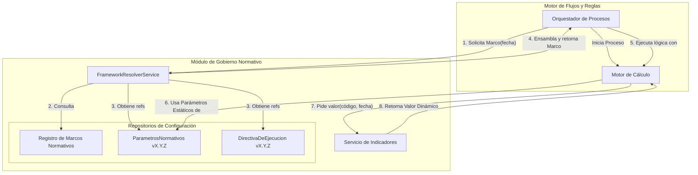

# Anexo J: Versionamiento Normativo y Resolución (Arquitectura Avanzada)

## 12.1. Arquitectura General

Para lograr la máxima flexibilidad y correctitud, la arquitectura de versionamiento se basa en una estricta separación de conceptos. El sistema distingue entre la lógica de un proceso, los parámetros estructurales de la ley y los valores económicos que cambian con el tiempo.

1.  **`ParametrosNormativos` (Datos Estáticos):** Artefacto versionado que contiene los valores **estructurales** de la ley (porcentajes, plazos, factores). Solo cambia cuando el texto de una ley se modifica. _Ej: `InvalidezTotalPct: 0.7`._
2.  **`Servicio de Indicadores` (Datos Dinámicos):** Componente de software que provee valores económicos volátiles (UF, IPC, Sueldo Mínimo, Monto PGU) para una fecha específica. Es la fuente de verdad para el **contexto económico**.
3.  **`DirectivaDeEjecucion` (Lógica de Procesos):** Artefacto versionado que mapea un escenario de negocio a una versión de código específica que debe ejecutarse.
4.  **`MarcoNormativo`:** Unidad que asocia una `versionParametros` y una `versionDirectiva` a un período de vigencia. **No incluye los datos dinámicos**, ya que estos se resuelven en tiempo de ejecución.

## 12.2. Cronología de Marcos Normativos (Modelo Avanzado)

Con esta arquitectura, la creación de nuevas versiones de `ParametrosNormativos` es menos frecuente, ya que los reajustes anuales son gestionados por el `Servicio de Indicadores`.

| Marco ID | `versionParametros` | `versionDirectiva` | Vigencia | Hito Normativo / Causa del Cambio |
| :--- | :--- | :--- | :--- | :--- |
| **`MN-1968-LEY-ORIGEN`** | `params-v1.0.0` | `logic-v1.0.0` | 1968-05-01 a 1980-10-31 | **Ley 16.744 - Origen.** Establecimiento del Seguro Social contra Riesgos de Accidentes del Trabajo y Enfermedades Profesionales. Define los parámetros y lógica inicial. |
| **`MN-1980-SISTEMA-AFP`** | `params-v1.1.0` | `logic-v2.0.0` | 1980-11-01 a ... | **D.L. 3.500 - Creación de AFPs.** Cambio estructural mayor en la lógica de cotizaciones. |
| ... | ... | ... | ... | *(Hitos legales menores y actualizaciones de lógica)* |
| **`MN-2008-REFORMA`** | `params-v3.0.0` | `logic-v4.0.0` | 2008-07-01 a 2014-12-31 | **Ley 20.255 - Reforma Previsional.** Introduce el Pilar Solidario. Cambio mayor. **Nota:** Los reajustes anuales de IPC/Sueldo Mínimo durante este período son actualizaciones en el `Servicio de Indicadores`, no requieren nuevos `Marcos`. |
| **`MN-2015-AUC`** | `params-v3.0.0` | `logic-v5.0.0` | 2015-10-22 a 2021-12-31 | **Ley 20.830 - Acuerdo de Unión Civil.** Se modifica la lógica de sobrevivencia. Se reutiliza la versión de parámetros `v3.0.0` pues no hay cambios estructurales de cálculo. |
| **`MN-2022-PGU`** | `params-v4.0.0` | `logic-v6.0.0` | 2022-02-01 a *null* | **Ley 21.419 - Pensión Garantizada Universal.** La PGU reemplaza al APS. Cambio mayor en parámetros (se elimina el APS) y lógica. Este es el **Marco Vigente**. |

## 12.3. Descripción del Marco Normativo Vigente: MN-2022-PGU

Este es el marco que rige todos los cálculos y procesos a partir del 1 de febrero de 2022.

-   **Versión de Parámetros:** `params-v4.0.0`
-   **Versión de Directiva:** `logic-v6.0.0`

### 12.3.1. Parámetros Normativos Estáticos (`params-v4.0.0`)

Contiene los porcentajes y plazos estructurales de la ley, que no varían con el IPC.

-   **Pensiones de Invalidez:**
    -   `InvalidezParcialPct`: **35%**
    -   `InvalidezTotalPct`: **70%**
    -   `GranInvalidezSuplementoPct`: **30%**
-   **Pensiones de Sobrevivencia:**
    -   `ViudezSinHijosPct`: **60%**
    -   `ViudezConHijosPct`: **50%**
    -   `OrfandadPct`: **20%**
-   **Plazos Legales:**
    -   `PagoIndemnizacionDiasHabiles`: **90 días**
    -   `PrescripcionCobroSubsidioMeses`: **6 meses**
-   **Referencias a Datos Dinámicos:**
    -   `TopeImponibleKey`: "TOPE_IMPONIBLE_UF"
    -   `MontoPensionMinimaKey`: "PENSION_MINIMA_VEJEZ"
    -   `MontoPGUKey`: "PGU_BASE"

### 12.3.2. Datos Dinámicos Resueltos por el `Servicio de Indicadores`

Este servicio provee los valores actualizados para una fecha determinada. El motor de cálculo los consume usando las claves de referencia definidas en los parámetros estáticos.

-   **`GET /indicadores/TOPE_IMPONIBLE_UF/2025-08-09`** -> `(ej: 81.6)`
-   **`GET /indicadores/PENSION_MINIMA_VEJEZ/2025-08-09`** -> `(ej: 193911)`
-   **`GET /indicadores/PGU_BASE/2025-08-09`** -> `(ej: 193917)`
-   **`GET /indicadores/VALOR_UF/2025-08-09`** -> `(ej: 36150.25)`

### 12.3.3. Directiva de Ejecución (`logic-v6.0.0`)

Ejecuta las versiones más recientes de los algoritmos, que saben cómo interactuar con el `Servicio de Indicadores`.

-   **`PDN-PAG-003 -> v5`**: Lógica de liquidación que invoca al `Servicio de Indicadores` para obtener el monto de la PGU y los topes imponibles actualizados antes de aplicar descuentos.
-   **`CALC-OTG-001 -> v4`**: Lógica de cálculo de sueldo base que también consulta los topes del `Servicio de Indicadores` para normalizar las rentas históricas.
-   **`PDN-MANT-001 -> v4`**: Proceso de cese por edad que compara la pensión del individuo con la Pensión Mínima vigente, obtenida del `Servicio de Indicadores`.