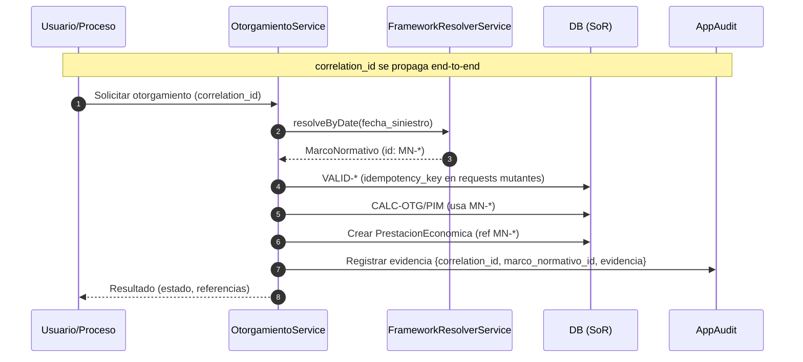
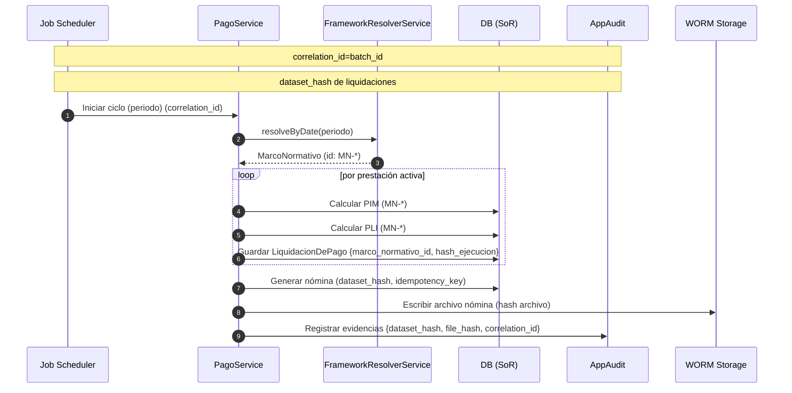
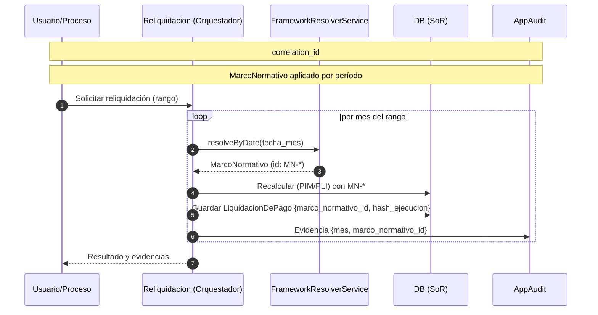
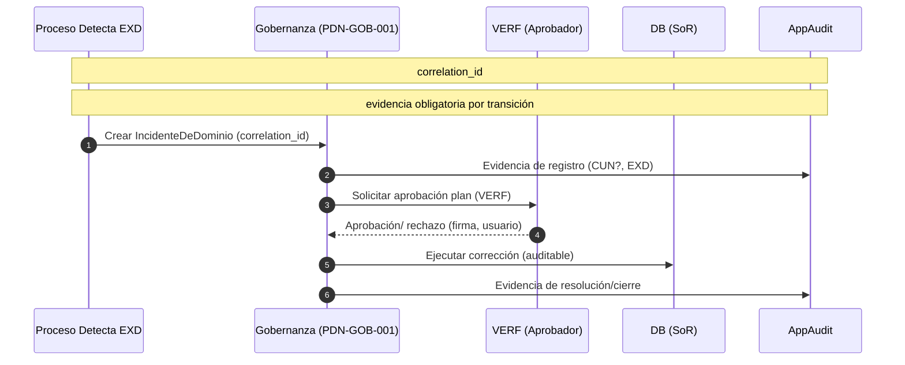

# 6. Vista de Ejecución (Runtime)

Escenarios y secuencias clave (resumen; ver detalles en MDLO v1 y `3_especificacion_tecnica/*`).

## 6.1 Otorgamiento de pensión
- Entradas: `HechoCausal`, `FichaPersona`, `MarcoNormativo` vigente.
- Flujo: VALID-* → CALC-OTG/PIM → crear `PrestacionEconomica` y EVT correspondiente.
- Salidas: `En_Evaluacion` → `Activa`/`Activa_Transitoria`/`Denegada`; evidencias y documentos.

Secuencia (Mermaid):

## 6.2 Ciclo de pago mensual
- Entradas: prestaciones activas, acuerdos de pago, parámetros del período, `MarcoNormativo` aplicable.
- Flujo: `PDN-PAG-002/003` (PIM/PLI); aplicar acuerdos; generar nómina bancaria, PREVIRED y comprobante SAP.
- Salidas: totales por nómina, eventos de aplicación, artefactos listos para envío.

Secuencia (Mermaid):

## 6.3 Reliquidación multi-marco
- Entradas: rango de períodos, cortes de marco, directiva activa.
- Flujo: ejecutar por mes con `FrameworkResolverService`; registrar evidencia del marco aplicado.
- Salidas: nuevas liquidaciones/ajustes; evidencia de marcos aplicados por período.

Secuencia (Mermaid):

## 6.4 Gestión de excepciones y VERF
- Entradas: EXD/EXP, roles autorizados.
- Flujo: diagnóstico, plan de acción, aprobación (VERF), ejecución y cierre.
- Salidas: eventos de negocio y actualización de proyecciones.

Secuencia (Mermaid):

