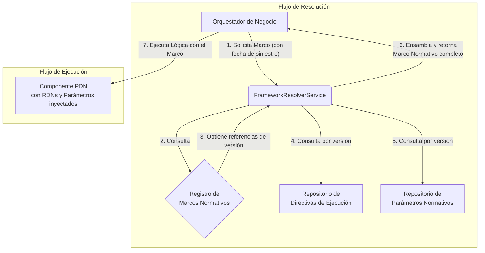

### **Especificación Técnica de Versionado y Resolución de Lógica de Dominio**

**Versión:** 1.0
**Fecha:** 2025-08-08

-----

### 1\. Propósito y Alcance

#### 1.1. Propósito

Esta especificación define el marco técnico y de gobernanza para gestionar la evolución de la lógica de negocio del sistema de Prestaciones Económicas (PEC). El dominio está sujeto a cambios normativos que pueden alterar tanto los **parámetros de cálculo** (ej. porcentajes, topes) como los **algoritmos de los procesos** (ej. cambios en la lógica de elegibilidad).

El objetivo es establecer una arquitectura que garantice la **inmutabilidad, auditabilidad y reproducibilidad** de cada transacción a lo largo del tiempo, permitiendo que el sistema opere con diferentes conjuntos de reglas de forma concurrente, basándose en el contexto de la transacción (principalmente, su fecha).

#### 1.2. Alcance

Este documento cubre:

  - Los principios de diseño del modelo de versionado.
  - La definición de los artefactos y componentes versionables.
  - La especificación técnica detallada de la implementación, incluyendo la estructura de configuración, el servicio de resolución y el registro de dependencias.
  - El flujo de ejecución de una transacción en un contexto versionado.
  - El proceso de gobernanza para la creación y activación de nuevas versiones.

-----

### 2\. Principios de Diseño

La arquitectura se sustenta en tres principios fundamentales:

##### 2.1. Inmutabilidad

Un artefacto de lógica o de parámetros, una vez versionado y utilizado en producción, se considera inmutable. Cualquier modificación requiere la creación de una **nueva versión** del artefacto, preservando el historial.

##### 2.2. Trazabilidad

Cada decisión y cálculo debe ser completamente rastreable hasta el conjunto exacto de componentes que lo ejecutaron. El sistema debe poder responder en cualquier momento a la pregunta: "¿Qué `MarcoNormativo`, con qué `ParametrosNormativos` y qué `DirectivaDeEjecucion`, se utilizó para procesar este caso?".

##### 2.3. Orquestación por Marco Normativo

El comportamiento del sistema no se define por componentes aislados, sino por un **`MarcoNormativo`** coherente y versionado. Cada operación es ejecutada en el contexto de un marco, el cual dicta de manera determinista toda la lógica y los parámetros a utilizar.

-----

### 3\. Arquitectura General

El modelo se basa en el desacoplamiento de los ciclos de vida de los parámetros y la lógica, los cuales son versionados en repositorios independientes y luego combinados en un `MarcoNormativo` a través de un **modelo de composición**.



-----

### 4\. Definición de Artefactos y Componentes

#### 4.1. Artefactos de Versionado

##### 4.1.1. `ParametrosNormativos`

  - **Descripción:** Un artefacto de configuración inmutable y versionado que contiene el conjunto completo de **parámetros de cálculo**: valores, topes, porcentajes, plazos y tablas de factores.
  - **Propósito:** Gestionar el **versionado paramétrico**. Se crea una nueva versión cada vez que un valor normativo cambia (ej. por reajuste de IPC o cambio del sueldo mínimo).
  - **Identificador:** Versionado Semántico (ej. `params-v1.2.1`).

##### 4.1.2. `DirectivaDeEjecucion`

  - **Descripción:** Un artefacto de configuración inmutable y versionado que mapea los identificadores de los `Procesos de Negocio (PDN)` y las `Reglas de Negocio (RDN)` a la versión específica de su implementación algorítmica.
  - **Propósito:** Gestionar el **versionado algorítmico**. Se crea una nueva versión solo cuando la lógica de un PDN o una RDN cambia.
  - **Identificador:** Versionado Semántico (ej. `logic-v3.1.0`).

##### 4.1.3. `MarcoNormativo`

  - **Descripción:** Es el **plano de ensamblaje** que define un conjunto de reglas completo y coherente. No contiene la lógica ni los parámetros directamente, sino que **referencia** la versión específica de una `DirectivaDeEjecucion` y una `ParametrosNormativos`. Cada `MarcoNormativo` tiene un período de vigencia definido.
  - **Propósito:** Unificar los componentes de versionado en una unidad ejecutable y gobernable.
  - **Identificador:** Semántico y descriptivo (ej. `MN-2025-LEY-NUEVA`).

#### 4.2. Componentes de Lógica

##### 4.2.1. `Proceso de Negocio (PDN)`

  - **Descripción:** Componente de software que implementa un flujo de trabajo de alto nivel (ej. Otorgamiento de Pensión).
  - **Naturaleza:** **Versionable algorítmicamente** a través de la `DirectivaDeEjecucion`.

##### 4.2.2. `Etapa de Negocio (EDN)`

  - **Descripción:** Fase lógica dentro de un PDN.
  - **Naturaleza:** **No versionable** de forma independiente. Forma parte de la implementación de una versión específica de un PDN.

##### 4.2.3. `Regla de Negocio (RDN)`

  - **Descripción:** Componente de software que implementa una lógica atómica de cálculo o validación.
  - **Naturaleza:** **Versionable algorítmicamente** a través de la `DirectivaDeEjecucion`. Su comportamiento también es afectado por el versionado paramétrico del `MarcoNormativo` activo.

-----

### 5\. Especificación Técnica Detallada

#### 5.1. Repositorios de Configuración

##### 5.1.1. `config/repositorio_parametros.ts`

Contiene todos los conjuntos de parámetros versionados.

```typescript
// config/repositorio_parametros.ts
export const RepositorioParametros: { [version: string]: any } = {
  'params-v1.1.0': {
    TasaCotizacionSalud: 0.07,
    TopeImponibleUF: 81.6,
    PlazosClave: { PagoIndemnizacionDiasHabiles: 90 },
  },
  'params-v1.1.1': { // Patch: Se corrige un plazo.
    TasaCotizacionSalud: 0.07,
    TopeImponibleUF: 81.6,
    PlazosClave: { PagoIndemnizacionDiasHabiles: 60 }, // CAMBIO
  },
};
```

##### 5.1.2. `config/repositorio_directivas.ts`

Contiene todas las directivas de ejecución versionadas.

```typescript
// config/repositorio_directivas.ts
export const RepositorioDirectivas: { [version: string]: any } = {
  'logic-v2.0.0': {
    pdn: { 'PDN-OTG-006': 'v3' },
    rdn: { 'VALID-SOBREV-001': 'v1' },
  },
  'logic-v2.1.0': { // Minor: Se actualiza un PDN y una RDN.
    pdn: { 'PDN-OTG-006': 'v4' }, // CAMBIO
    rdn: { 'VALID-SOBREV-001': 'v2' }, // CAMBIO
  },
};
```

##### 5.1.3. `config/marcos_normativos.ts`

Compone los Marcos Normativos a partir de los repositorios y les asigna un período de vigencia.

```typescript
// config/marcos_normativos.ts
export interface MarcoNormativoRef {
  versionParametros: string;
  versionDirectiva: string;
  vigencia: { inicio: string; fin: string | null };
}

export const RegistroMarcosNormativos: { [id: string]: MarcoNormativoRef } = {
  'MN-2024-BASE': {
    versionParametros: 'params-v1.1.0',
    versionDirectiva: 'logic-v2.0.0',
    vigencia: { inicio: '2024-01-01', fin: '2024-12-31' },
  },
  'MN-2025-REFORMA-LEY': {
    versionParametros: 'params-v1.1.1',
    versionDirectiva: 'logic-v2.1.0',
    vigencia: { inicio: '2025-01-01', fin: null },
  },
};
```

#### 5.2. Estructura de Directorios para Componentes Versionados

```
app/
└── lib/
    ├── pdn/
    │   └── otorgamiento/
    │       └── PDN_OTG_006/
    │           ├── PdnOtg006_v3.ts
    │           └── PdnOtg006_v4.ts
    └── calculo/
        └── rdn/
            └── valid/
                └── VALID-SOBREV-001/
                    ├── ValidSobrev001_v1.ts
                    └── ValidSobrev001_v2.ts
```

#### 5.3. Servicio de Resolución (`FrameworkResolverService`)

  - **Ubicación:** `app/lib/core/FrameworkResolverService.ts`
  - **API Pública:**
      - `resolveByDate(fecha: Date): Promise<MarcoNormativoCompleto>`: Método principal. Busca en el `RegistroMarcosNormativos` la entrada cuya `vigencia` contiene la fecha. Lanza una excepción si no encuentra un marco único y válido.
      - `resolveById(id: string): Promise<MarcoNormativoCompleto>`: Método secundario para casos de uso especiales (simulaciones, correcciones).
  - **Funcionamiento Interno:** Una vez identificado el `MarcoNormativoRef`, el resolver obtiene las versiones de parámetros y directiva, las busca en sus respectivos repositorios y las ensambla en un objeto `MarcoNormativoCompleto` que se pasa al resto de la aplicación.

#### 5.4. Registro en Contenedor IoC y Dependencias

  - El `PdnProvider` (`providers/PdnProvider.ts`) registrará todas las implementaciones versionadas de PDN y RDN con un binding único (ej. `pdn/PDN-OTG-006/v4`).
  - La `PdnFactoryService` (o una capa dentro del `FrameworkResolverService`) se encargará de instanciar los componentes PDN, inyectando las versiones correctas de sus dependencias RDN en el constructor, según lo dictado por la `DirectivaDeEjecucion` activa.

-----

### 6\. Flujo de Ejecución de Extremo a Extremo

1.  **Contexto:** Se inicia el proceso de otorgamiento para un siniestro ocurrido el `2025-02-15`.
2.  **Orquestación:** El `OtorgamientoService` recibe el caso.
3.  **Resolución de Marco:** Llama a `frameworkResolver.resolveByDate(new Date('2025-02-15'))`.
4.  **Búsqueda:** El resolver examina `RegistroMarcosNormativos` y encuentra que `'MN-2025-REFORMA-LEY'` es el marco activo para esa fecha.
5.  **Composición:** El resolver:
    a. Obtiene `versionParametros: 'params-v1.1.1'` y `versionDirectiva: 'logic-v2.1.0'`.
    b. Carga el objeto de parámetros desde `RepositorioParametros['params-v1.1.1']`.
    c. Carga el objeto de directiva desde `RepositorioDirectivas['logic-v2.1.0']`.
    d. Ensambla el `MarcoNormativoCompleto` y lo retorna.
6.  **Resolución de Proceso:** El `OtorgamientoService` necesita ejecutar `PDN-OTG-006`. Llama a la fábrica con el marco completo.
7.  **Inyección y Ejecución:** La fábrica consulta la directiva del marco, ve que debe usar `PDN-OTG-006` en su versión `v4`. Resuelve `PdnOtg006_v4` desde el contenedor IoC, inyectándole la versión correcta de sus dependencias (ej. `ValidSobrev001_v2`) y los parámetros (`params-v1.1.1`). Finalmente, el `OtorgamientoService` ejecuta el proceso.

-----

### 7\. Gobernanza del Ciclo de Vida

La introducción de una nueva versión sigue un proceso formal:

1.  **Identificación del Cambio:** Un ente regulador, legal o de negocio identifica la necesidad de un cambio algorítmico o paramétrico.
2.  **Desarrollo y Versionado:** El equipo técnico implementa los nuevos archivos de PDN/RDN o define el nuevo objeto de parámetros, asignando un nuevo identificador de versión semántico.
3.  **Composición de un Nuevo `MarcoNormativo`:** Se define una nueva entrada en `RegistroMarcosNormativos`, componiendo las versiones de artefactos (nuevas y existentes) y asignándole un período de vigencia.
4.  **Certificación:** El nuevo `MarcoNormativo` es validado de forma integral en un entorno de pruebas con escenarios de negocio que cubren los cambios.
5.  **Activación:** Tras la certificación, la nueva configuración se despliega a producción. A partir de la `fecha de inicio` de su `vigencia`, el nuevo marco será seleccionado automáticamente por el sistema para las transacciones correspondientes.