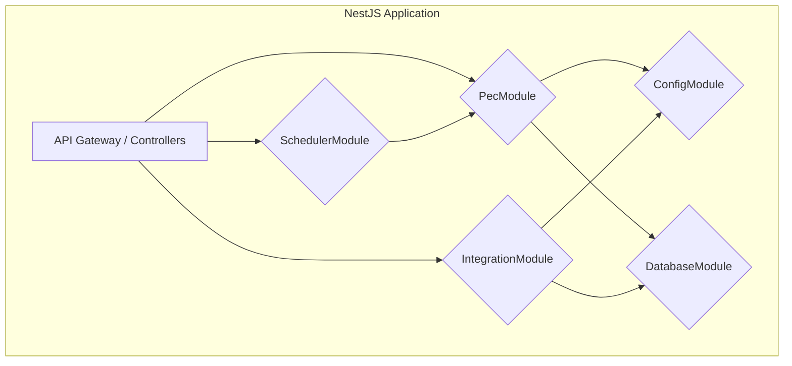

# Especificación de Solución Técnica: Sistema de Prestaciones Económicas (PEC)

**Fecha:** 2025-08-06
**Framework Base:** NestJS 11
**Propósito:** Servir como documento base para la planificación del proyecto de desarrollo, permitiendo la estimación de tiempos, recursos y la definición de roles del equipo.

---

## 1. Resumen Ejecutivo

Este documento traduce la especificación funcional y de dominio del **Manual del Dominio Lógico y Operacional (MDLO) v2** a una especificación de solución técnica concreta. La arquitectura propuesta utiliza el framework **NestJS 11** sobre Node.js con TypeScript, elegido por su robusta modularidad, su potente sistema de Inyección de Dependencias (DI) y su excelente alineación con los principios de la Arquitectura Orientada al Dominio (DDD), que son fundamentales para el MDLO.

El objetivo es definir una estructura de proyecto clara y modular que permita:

1.  **Descomponer el trabajo** en paquetes manejables y estimables.
2.  **Definir los roles y habilidades** necesarios en el equipo de desarrollo.
3.  **Establecer una hoja de ruta** de implementación por fases.

---

## 2. Principios Arquitectónicos

La solución se regirá por los siguientes principios para garantizar la mantenibilidad, escalabilidad y auditabilidad exigidas por el dominio.

-   **Arquitectura Modular:** El sistema se organizará en módulos de NestJS cohesivos y débilmente acoplados. Cada módulo encapsulará una capacidad de negocio específica (ej. `ConfigModule`, `PecModule`, `IntegrationModule`).
-   **Domain-Driven Design (DDD):** El código reflejará directamente el lenguaje y la estructura del MDLO. Las entidades (`Anexo B`), los procesos (`Anexo C`) y las reglas (`Anexo D`) serán artefactos de primera clase en la arquitectura.
-   **Clean Architecture:** Se mantendrá una estricta separación de capas. Los controladores de API manejarán las solicitudes HTTP, los servicios contendrán la lógica de negocio (PDN, EDN), y los repositorios abstraerán el acceso a datos.
-   **Configuración como Código (Configuration as Code):** Los **Snapshots Normativos (SNA)** del `Anexo J` se tratarán como archivos de configuración versionados, cargados en tiempo de ejecución para gobernar el comportamiento del sistema.
-   **ORM y Base de Datos:** Se utilizará **Prisma** como ORM por su alta seguridad de tipos, lo que es crucial para manejar el complejo modelo de datos del MDLO y reducir errores en tiempo de ejecución.

---

## 3. Descomposición de Módulos y Componentes

La siguiente estructura de módulos de NestJS servirá como base para la planificación y asignación de tareas.

### 3.1. Módulo: `ConfigModule`
-   **Responsabilidad:** Cargar, validar y proporcionar acceso a toda la configuración de la aplicación, con un enfoque especial en los Snapshots Normativos (SNA).
-   **Componentes Clave:**
    -   `SnaService`: Servicio principal que, dada una fecha, localiza, carga y devuelve el SNA correcto desde los archivos JSON en `config/sna/`. Este servicio es crítico y debe ser una de las primeras piezas en desarrollarse.
-   **Estimación:** Este es un módulo fundacional de complejidad media. Su correcta implementación es un prerrequisito para casi todo lo demás.

### 3.2. Módulo: `PecModule` (Módulo Principal del Dominio)
-   **Responsabilidad:** Contener toda la lógica de negocio principal de las Prestaciones Económicas (PDN, EDN, RDN).
-   **Componentes Clave (Sub-dominios):**
    -   **`governance`**: Implementa el patrón de **Orquestador/Factory** para el versionado normativo. Es el componente más complejo y de mayor riesgo arquitectónico.
        -   `PdnFactory`: El corazón del orquestador. Un proveedor inyectable que, basándose en un identificador de PDN del SNA, devuelve la instancia de la clase de proceso correcta.
    -   **`common`**: Define las interfaces de TypeScript (`IPdn`, `IEdn`, `IRdn`), DTOs (Data Transfer Objects) y las entidades de Prisma que se comparten a través del módulo.
    -   **`pdn`**: Contiene las implementaciones de los Procesos de Negocio. Cada PDN versionado es una clase que implementa `IPdn`. (Ej. `PdnOtg002V1Service`, `PdnOtg002V2Service`).
    -   **`edn`**: Contiene las implementaciones de las Etapas de Negocio. Son servicios reutilizables inyectados en los servicios de PDN.
    -   **`rdn`**: Contiene la lógica más atómica, las Reglas de Negocio. Son servicios inyectados en las EDN.
-   **Estimación:** Este es el módulo más grande y complejo. El trabajo aquí puede ser paralelizado una vez que la sub-sección de `governance` esté definida. La cantidad de RDNs y PDNs es un indicador directo del volumen de trabajo.

### 3.3. Módulo: `IntegrationModule`
-   **Responsabilidad:** Manejar toda la comunicación con sistemas externos, como se define en el `Anexo E`.
-   **Componentes Clave:**
    -   `SusesoService`: Lógica para interactuar con SUSESO (SFTP, CSVs).
    -   `IpsService`: Lógica para interactuar con IPS.
    -   `PreviredService`: Lógica para generar y enviar archivos a PREVIRED.
    -   `SapService`: Lógica para la generación de comprobantes contables.
    -   ...y así sucesivamente para cada integración (Registro Civil, Banco, CCAF, etc.).
-   **Estimación:** El trabajo es significativo y depende de la complejidad de cada integración. Puede ser paralelizado y asignado a diferentes desarrolladores.

### 3.4. Módulo: `SchedulerModule`
-   **Responsabilidad:** Ejecutar tareas programadas, principalmente los procesos de monitoreo (`PDN-MON`) definidos en el `Anexo C`.
-   **Componentes Clave:**
    -   Se utilizará el paquete `@nestjs/schedule` para definir los cron jobs.
    -   `MonitoreoPlazoService`: Tarea que se ejecuta diariamente para verificar SLAs (`PDN-MON-001`).
    -   `MonitoreoCesePorEdadService`: Tarea mensual que busca beneficiarios próximos a cumplir edad de cese (`PDN-MON-004`).
-   **Estimación:** Complejidad media. Requiere una lógica de consulta de base de datos eficiente.

### 3.5. Módulo: `DatabaseModule`
-   **Responsabilidad:** Configurar y proporcionar una instancia del cliente de Prisma para que el resto de la aplicación interactúe con la base de datos.
-   **Estimación:** Módulo simple, de baja complejidad.

---

## 4. Metodología de Estimación Cuantitativa

Para traducir esta especificación técnica en un plan de trabajo cuantificable, se propone una metodología de estimación basada en "Puntos de Complejidad de Componente" (PCC), una métrica abstracta y relativa que mide el esfuerzo requerido para implementar un artefacto de software.

### 4.1. Puntos de Complejidad de Componente (PCC)

El PCC de un componente se calcula como la suma de tres dimensiones, cada una valorada en una escala de 1 (trivial) a 5 (muy alta):

**PCC = Lógica de Negocio (L) + Dependencias Externas (D) + Complejidad de Pruebas (T)**

-   **Lógica (L):** ¿Cuán complejos son los cálculos, las validaciones y los algoritmos?
-   **Dependencias (D):** ¿Cuántos otros servicios, módulos o componentes externos necesita para funcionar?
-   **Pruebas (T):** ¿Cuán difícil es crear un escenario de prueba completo y automatizado para este componente?

El rango de PCC para un componente individual va de 3 (1+1+1) a 15 (5+5+5).

### 4.2. Paquetes de Implementación

Un "Paquete" es la unidad de trabajo completa (código de la clase, DTOs, pruebas unitarias y de integración) asociada a un artefacto del MDLO.

-   **Paquete de RDN (Regla de Negocio):** Implementa una regla del `Anexo D`.
    -   **PCC Simple (6):** L:2, D:2, T:2. Lógica simple, pocas dependencias.
    -   **PCC Medio (9):** L:4, D:2, T:3. Lógica más elaborada, requiere mocking.
    -   **PCC Complejo (12):** L:5, D:3, T:4. Lógica muy compleja, múltiples dependencias.

-   **Paquete de PDN (Proceso de Negocio):** Implementa un proceso del `Anexo C`.
    -   **PCC Simple (8):** L:3, D:3, T:2. Orquesta pocas RDNs.
    -   **PCC Medio (12):** L:4, D:4, T:4. Orquesta varias RDNs y EDNs.
    -   **PCC Complejo (15):** L:5, D:5, T:5. Orquesta flujos complejos, maneja estado y transacciones.

-   **Paquete de Integración:** Implementa una interfaz del `Anexo E`.
    -   **PCC Medio (10):** L:3, D:3, T:4. Formato de datos estándar (ej. REST/JSON).
    -   **PCC Complejo (14):** L:4, D:5, T:5. Formatos no estándar (ej. SFTP, CSV, archivos de ancho fijo).

### 4.3. Resumen Cuantitativo del Proyecto

Basado en el análisis del MDLO v2, el alcance total del proyecto se desglosa de la siguiente manera:

| Categoría del Artefacto | Cantidad Total | Desglose (Simple/Medio/Complejo) | PCC Totales por Categoría |
| :--- | :---: | :--- | :---: |
| **Procesos de Negocio (PDN)** | 40 | 11 S, 17 M, 12 C | **492** |
| **Reglas de Negocio (RDN)** | 19 | 5 S, 8 M, 6 C | **174** |
| **Integraciones Externas** | 8 | 0 S, 4 M, 4 C | **96** |
| **Tareas Fundacionales** | 7 | N/A (Estimación directa) | **80** |
| **Tareas de QA y Despliegue** | 7 | N/A (Estimación directa) | **73** |
| **Soporte y Estabilización** | 4 | N/A (Estimación directa) | **36** |
| **Total Estimado** | **85** | | **~951** |

---

## 5. Fases del Proyecto y Hoja de Ruta

El proyecto se ejecutará en "Vertical Slices" para entregar valor incremental y mitigar riesgos tempranamente.

| Fase | Sprints | Objetivo Principal | Complejidad |
| :--- | :--- | :--- | :---: |
| **Fase 0** | 0-3 | **Fundación Arquitectónica:** Construir el esqueleto de la aplicación, IaC y herramientas de prueba. | **80 PCC** |
| **Fase 1** | 4-7 | **MVP - Flujo de Otorgamiento:** Implementar un flujo de otorgamiento completo para validar la arquitectura. | **68 PCC** |
| **Fase 2** | 7-11 | **Pagos y Cotizaciones:** Implementar el ciclo de pago mensual y sus integraciones críticas. | **263 PCC** |
| **Fase 3** | 12-17 | **Mantenimiento del Ciclo de Vida:** Implementar los procesos de cese, suspensión y reajuste. | **253 PCC** |
| **Fase 4** | 18-22 | **Gobernanza y Finanzas:** Implementar flujos de intervención humana y procesos financieros. | **163 PCC** |
| **Fase 5** | 23-27 | **Reportería y Pruebas Avanzadas:** Completar informes regulatorios y pruebas no funcionales. | **86 PCC** |
| **Fase 6** | 28-29 | **Estabilización y Soporte:** Asegurar una transición suave a producción y transferir conocimiento. | **38 PCC** |

---

## 6. Estructura y Roles del Equipo

Para ejecutar este plan, se recomienda la siguiente estructura de equipo:

-   **1x Tech Lead / Arquitecto de Software:** Responsable del diseño general, la implementación de la Fase 0 y de asegurar la coherencia arquitectónica.
-   **4-6x Desarrolladores Backend (Senior/Mid-level):** El equipo principal con sólida comprensión de TypeScript, NestJS, DDD y Prisma.
-   **1x Ingeniero DevOps:** Responsable de la infraestructura (IaC), CI/CD, y la configuración de las integraciones seguras.
-   **1-2x Ingenieros de QA / SDET:** Responsables de crear planes de prueba basados en el `Anexo G` y de automatizar las pruebas de regresión y E2E.
-   **1x Analista de Negocio (BA) / Experto en Dominio:** Actúa como puente entre el MDLO y el equipo para resolver ambigüedades.
-   **1x Jefe de Proyecto / Scrum Master:** Gestiona el backlog, las ceremonias ágiles y la comunicación con los stakeholders.
