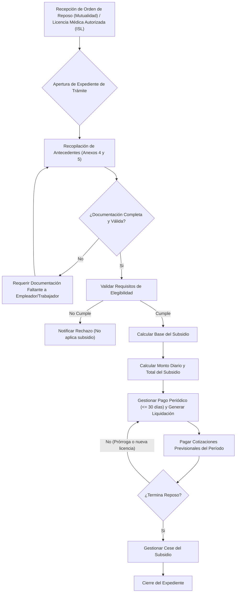

De acuerdo. He revisado nuevamente la normativa y he reestructurado el análisis para asegurar que no falten procesos y, más importante aún, para distinguir explícitamente las **Reglas de Negocio** dentro de cada proceso. Esta distinción es fundamental para un diseño de software claro y preciso.

-----

### **Versión del Documento: 2.0**

### **Fecha: 13 de agosto de 2025**

### **Autor: NormPE**

-----

## **Subdominio: Gestión de Prestaciones Económicas Transitorias**

Este subdominio se encarga de todo el ciclo de vida del **Subsidio por Incapacidad Laboral (SIL)**, que corresponde a la prestación económica que reemplaza la remuneración de un trabajador mientras se encuentra temporalmente incapacitado debido a un accidente del trabajo o una enfermedad profesional.

### **1. Bounded Context (Contexto Delimitado): `Gestión de Subsidios por Incapacidad Temporal`**

Este contexto es responsable de la administración completa de los subsidios, desde la recepción de una orden de reposo hasta el cese del pago del beneficio. Su principal objetivo es asegurar el cálculo correcto, el pago oportuno y el cumplimiento normativo en cada etapa, incluyendo las interacciones con el trabajador y la reportería interna.

#### **1.1. Agregado Principal: `Expediente de Subsidio`**

El `Expediente de Subsidio` es el agregado central de este contexto. Representa un caso único de subsidio para un trabajador.

  * **Raíz del Agregado (Aggregate Root):** `Expediente`.
      * **Identificador:** Código Único Nacional (CUN).
  * **Entidades Internas:**
      * `CálculoSubsidio`: Contiene las bases de cálculo, remuneraciones consideradas y el monto diario determinado.
      * `PagoSubsidio`: Representa cada una de las transacciones de pago realizadas, incluyendo fechas, montos y liquidaciones.
      * `PeriodoReposo`: Modela cada licencia u orden de reposo, con sus fechas de inicio y fin.
      * `CotizaciónPrevisional`: Registra las cotizaciones de salud y pensión que la mutualidad debe pagar durante el periodo de subsidio.
  * **Objetos de Valor (Value Objects):**
      * `Monto`: Representa una cantidad de dinero con su unidad monetaria.
      * `BaseDeCalculo`: Compuesta por las remuneraciones netas de los meses correspondientes.
      * `DatosTrabajador`: RUT, nombre, datos de contacto.
      * `DatosEmpleador`: RUT, razón social.
      * `MedioDePago`: Contiene la información de la cuenta bancaria o forma de pago elegida por el trabajador.

### **2. Diagrama del Proceso de Negocio General**

El siguiente diagrama de flujo ilustra el ciclo de vida de un subsidio por incapacidad temporal.

### **3. Listado Exhaustivo de Procesos de Negocio y sus Reglas**

A continuación, se detallan los procesos de negocio, incluyendo ahora una sección específica para las **Reglas de Negocio Clave** que gobiernan cada uno.

#### **Procesos Generales y de Soporte**

-----

##### **Proceso 1: Facilitar Consulta de Trámite en Línea**

  * **Descripción:** Provee al trabajador o beneficiario una plataforma web para consultar el estado de su trámite de prestación económica de forma autónoma y segura.
  * **Pasos Clave:**
    1.  [cite\_start]Habilitar un banner o sección en el sitio web institucional para la consulta de trámites[cite: 46].
    2.  [cite\_start]Proporcionar al trabajador un nombre de usuario y una clave de acceso para garantizar la confidencialidad[cite: 47].
    3.  [cite\_start]Desplegar información relevante del trámite: estado, documentación pendiente, fecha estimada de pago, medio de pago y liquidaciones de subsidio[cite: 46, 48].
  * **Reglas de Negocio Clave:**
      * [cite\_start]El acceso a la plataforma debe ser estrictamente confidencial, cumpliendo con la Ley N°19.628 sobre Protección de la Vida Privada[cite: 49].
      * [cite\_start]Se debe informar a los usuarios que la clave de acceso es de su responsabilidad y debe mantenerse en estricta reserva[cite: 50].
      * [cite\_start]La plataforma debe mostrar la base de cálculo de los subsidios y permitir el acceso a las liquidaciones[cite: 48].

-----

##### **Proceso 2: Gestionar Poderes y Mandatos para Trámite y Cobro**

  * **Descripción:** Administra la autorización que un trabajador o beneficiario otorga a un tercero para tramitar y/o cobrar sus prestaciones económicas.
  * **Pasos Clave:**
    1.  [cite\_start]Proporcionar gratuitamente un formato de Poder Simple para la tramitación[cite: 41].
    2.  [cite\_start]Verificar que el Poder Simple cumpla con los requisitos del Anexo N°1[cite: 40].
    3.  [cite\_start]Para el cobro de la prestación por parte de un tercero, requerir un mandato suscrito ante notario[cite: 42].
    4.  [cite\_start]Validar que el mandato notarial faculte expresamente al mandatario para cobrar la prestación[cite: 43].
    5.  [cite\_start]Controlar la vigencia del mandato, que no puede exceder los dos años[cite: 43].
  * **Reglas de Negocio Clave:**
      * [cite\_start]Para la **tramitación** por un tercero, es suficiente un **Poder Simple**[cite: 40].
      * [cite\_start]Para el **cobro** por un tercero, se exige un **mandato notarial**[cite: 42].
      * [cite\_start]El plazo de un mandato para cobro no puede exceder los dos años[cite: 43].
      * [cite\_start]Si un mandato caduca y no se renueva, el pago debe realizarse directamente al beneficiario[cite: 44].

-----

##### **Proceso 3: Publicar Acreencias No Cobradas**

  * **Descripción:** Mantiene un buscador en línea para que los trabajadores puedan consultar prestaciones económicas que han sido emitidas pero no cobradas.
  * **Trigger:** Proceso agendado mensualmente.
  * **Pasos Clave:**
    1.  [cite\_start]Implementar un buscador de acreencias en el sitio web, accesible mediante el RUT del trabajador[cite: 75].
    2.  El último día hábil de cada mes, actualizar la base de datos del buscador.
    3.  [cite\_start]Incluir en la publicación todas las prestaciones económicas (subsidios, indemnizaciones, pensiones, etc.) pendientes de cobro por más de 30 días hábiles[cite: 76].
  * **Reglas de Negocio Clave:**
      * [cite\_start]La información debe actualizarse mensualmente, el último día hábil[cite: 76].
      * [cite\_start]Un beneficiario debe permanecer en el registro hasta que cobre la prestación o hasta que su derecho prescriba[cite: 77].

-----

##### **Proceso 4: Monitorear Indicadores de Gestión de Subsidios**

  * **Descripción:** Mide y controla los tiempos y la eficiencia del proceso de otorgamiento y pago de prestaciones económicas.
  * **Pasos Clave:**
    1.  [cite\_start]Construir indicadores que midan los tiempos del proceso, desde la apertura del expediente hasta el cobro efectivo por parte del beneficiario[cite: 20, 21].
    2.  Realizar un seguimiento periódico de estos indicadores.
    3.  [cite\_start]Presentar los resultados a la alta administración y al Directorio para su monitoreo[cite: 21].
  * **Reglas de Negocio Clave:**
      * [cite\_start]Se deben monitorear los tiempos de otorgamiento y pago de todas las prestaciones[cite: 20].
      * [cite\_start]Es una obligación realizar gestiones administrativas y operacionales para optimizar los procesos basándose en estos indicadores[cite: 22].

-----

#### **Procesos del Ciclo de Vida del Subsidio**

-----

##### **Proceso 5: Iniciar Expediente de Trámite de Subsidio**

  * **Descripción:** Crea formalmente un caso de subsidio en el sistema.
  * [cite\_start]**Trigger:** Emisión de una `Orden de Reposo Ley N°16.744`[cite: 89].
  * **Pasos Clave:**
    1.  [cite\_start]Crear un expediente de trámite (físico o electrónico) con la información inicial de la orden de reposo[cite: 19, 25].
    2.  [cite\_start]Asegurar que el expediente tenga como identificador, a lo menos, el Código Único Nacional (CUN)[cite: 19].
    3.  [cite\_start]Registrar la fecha de recepción de la orden de reposo como inicio del trámite[cite: 35].
  * **Reglas de Negocio Clave:**
      * [cite\_start]La sola emisión de la orden de reposo obliga a dar inicio al proceso para determinar el subsidio[cite: 89].
      * [cite\_start]El expediente de trámite es el elemento que da inicio al proceso de otorgamiento y cálculo[cite: 19].

-----

##### **Proceso 6: Recopilar Antecedentes para Cálculo**

  * **Descripción:** Reúne la documentación necesaria para calcular el monto del subsidio.
  * **Trigger:** `Expediente de Subsidio` en estado "Iniciado".
  * **Pasos Clave:**
    1.  [cite\_start]Requerir al empleador (o trabajador independiente) la documentación de los Anexos N°4 o N°5[cite: 93].
    2.  [cite\_start]Registrar todas las gestiones de contacto para obtener la documentación[cite: 36].
    3.  [cite\_start]Respaldar electrónicamente toda la documentación recopilada[cite: 132].
  * **Reglas de Negocio Clave:**
      * [cite\_start]El requerimiento al empleador debe realizarse dentro del **primer día hábil** siguiente al inicio del reposo[cite: 93].
      * [cite\_start]El empleador tiene un plazo de **3 días hábiles** para enviar la documentación desde la recepción del requerimiento[cite: 93].
      * [cite\_start]Si no se recibe la documentación, se debe **reiterar la solicitud** las veces que sea necesario[cite: 96].
      * [cite\_start]El trabajador dependiente **siempre podrá presentar** la documentación requerida a su empleador para agilizar el trámite[cite: 94].

-----

##### **Proceso 7: Validar Requisitos de Elegibilidad**

  * **Descripción:** Verifica que el trabajador cumple con las condiciones normativas para tener derecho al subsidio.
  * **Trigger:** `Expediente` con documentación preliminar.
  * **Pasos Clave:** Revisar la situación de afiliación y cotizaciones del trabajador según su categoría (dependiente o independiente).
  * **Reglas de Negocio Clave:**
      * [cite\_start]**Regla General:** Debe existir una `Orden de Reposo Ley N°16.744` emitida por un médico o dentista de la mutualidad[cite: 104].
      * [cite\_start]**Trabajadores Dependientes:** No se exigen tiempo mínimo de afiliación ni densidad de cotizaciones[cite: 106].
      * **Independientes Obligados (Art. 88):**
          * [cite\_start]Deben estar registrados en la mutualidad **antes** del accidente o diagnóstico[cite: 109].
          * [cite\_start]El siniestro debe ocurrir dentro del **período de cobertura** (1 de julio a 30 de junio)[cite: 111].
          * Deben estar **al día en el pago de cotizaciones**. [cite\_start]Se considera "al día" si el saldo insoluto es cero, o si se paga mensualmente la cuota correspondiente a dicho saldo[cite: 112, 116, 118].
      * **Independientes Voluntarios (Art. 89):**
          * [cite\_start]Deben estar registrados **antes** del siniestro[cite: 122].
          * [cite\_start]Deben haber cotizado el **mes anteprecedente** al siniestro, o tener al menos **seis cotizaciones** en los últimos doce meses[cite: 123].
          * [cite\_start]**Excepción Primera Afiliación:** Durante los 3 primeros meses desde el registro, acceden al beneficio si pagan la cotización del mes del siniestro (a más tardar el mes siguiente)[cite: 125].

-----

##### **Proceso 8: Calcular Base del Subsidio y Monto Diario**

  * **Descripción:** Determina el monto base sobre el cual se calculará el subsidio diario.
  * **Trigger:** `Expediente` con estado "Elegibilidad Confirmada" y documentación completa.
  * **Pasos Clave:** Aplicar las fórmulas y consideraciones aritméticas definidas en la normativa.
  * **Reglas de Negocio Clave:**
      * [cite\_start]**Base de Cálculo (Dependientes):** Es el promedio de la **remuneración mensual neta** de los **3 meses calendario** más próximos al mes de inicio del reposo[cite: 219].
      * [cite\_start]**Componentes de la Remuneración:** Se excluyen remuneraciones ocasionales (aguinaldos, bono escolaridad) [cite: 163] [cite\_start]y pagos "a todo evento"[cite: 170]. [cite\_start]Se incluyen remuneraciones variables como comisiones y bonos de productividad[cite: 167, 168].
      * [cite\_start]**Cálculo de Remuneración Neta:** Es la remuneración imponible menos las cotizaciones de pensión y salud, y menos el impuesto correspondiente[cite: 237].
      * [cite\_start]**Amplificación:** Las remuneraciones deben amplificarse a mes completo si se trabajó menos días de los pactados en el contrato, salvo que la ausencia fuera por subsidio[cite: 172]. [cite\_start]No se amplifican ítems que no dependen de los días trabajados, como comisiones[cite: 181].
      * **Manejo de Meses sin Remuneración:** Si faltan meses para el promedio, se debe usar la **remuneración fija pactada** en el contrato de trabajo vigente. [cite\_start]Si solo hay remuneración variable, se usa el ingreso mínimo[cite: 221, 222, 223].
      * [cite\_start]**Cálculo Monto Diario (Dependientes):** La suma de las 3 remuneraciones mensuales netas se divide por **90**[cite: 278].
      * [cite\_start]**Base de Cálculo (Independientes Obligados):** Es la **renta imponible anual** (usada para la cotización obligatoria) dividida por **12**[cite: 247]. [cite\_start]El resultado se divide por **30** para obtener el monto diario[cite: 305].
      * [cite\_start]**Base de Cálculo (Independientes Voluntarios):** Es el promedio de las rentas imponibles de los **últimos 6 meses** anteriores al inicio de la incapacidad[cite: 256]. [cite\_start]La suma de las 6 rentas mensuales netas se divide por **180** para obtener el monto diario[cite: 314].
      * [cite\_start]**Subsidio Mínimo:** El monto diario del subsidio no puede ser inferior a la trigésima parte del 50% del ingreso mínimo para fines no remuneracionales[cite: 326].

-----

##### **Proceso 9: Gestionar Subsidio para Trabajador con Múltiples Empleadores**

  * **Descripción:** Maneja el caso especial de un trabajador que tiene dos o más empleadores afiliados a distintos organismos administradores.
  * **Trigger:** Detección en la recopilación de antecedentes de que el trabajador tiene múltiples empleadores.
  * **Pasos Clave:**
    1.  Identificar todos los empleadores y sus respectivos organismos administradores.
    2.  Coordinar con los otros organismos para el pago del subsidio.
  * **Reglas de Negocio Clave:**
      * [cite\_start]Si un trabajador presta servicios a dos o más empleadores, tendrá derecho a que **cada organismo administrador pague el subsidio correspondiente**, calculado en base a las remuneraciones imponibles de cada empleo[cite: 322].
      * [cite\_start]El mismo criterio aplica si el trabajador es dependiente e independiente simultáneamente[cite: 323].

-----

##### **Proceso 10: Gestionar Pago de Subsidio**

  * **Descripción:** Autoriza y ejecuta el pago periódico del subsidio.
  * **Trigger:** `MontoDiarioSubsidio` calculado.
  * **Pasos Clave:** Realizar el pago y entregar la liquidación correspondiente.
  * **Reglas de Negocio Clave:**
      * [cite\_start]**Periodicidad:** El subsidio debe pagarse con una periodicidad igual o inferior a **30 días**[cite: 380].
      * [cite\_start]**Plazo Máximo Primer Pago:** El pago debe efectuarse dentro de un plazo máximo de **30 días**, contados desde la emisión de la `Orden de Reposo`[cite: 429].
      * **Liquidación de Pago:** Se debe generar una liquidación que contenga, como mínimo, la identificación del trabajador, número de licencia/reposo, días pagados y detalle de cotizaciones. [cite\_start]La primera liquidación debe detallar el cálculo del subsidio diario[cite: 386, 387].
      * [cite\_start]**Descuentos:** Al subsidio no se le puede realizar ningún tipo de descuento (préstamos, CCAF, etc.), salvo retenciones por sentencia judicial[cite: 390].
      * **Redondeo:** Para pagos en efectivo, las cantidades iguales o inferiores a $5 se deprecian a la decena inferior, y las iguales o superiores a $6 se elevan a la decena superior. [cite\_start]Esto no aplica para transferencias electrónicas o cheques[cite: 69, 70].
      * [cite\_start]**Reembolso a Sector Público:** Se debe reembolsar a las entidades empleadoras del sector público una suma equivalente al subsidio, ya que estas pagan la remuneración completa durante la licencia[cite: 394]. [cite\_start]Tienen un plazo de **6 meses** para solicitar el reembolso[cite: 399].

-----

##### **Proceso 11: Gestionar Pago de Cotizaciones Previsionales**

  * **Descripción:** Paga las cotizaciones del trabajador durante su incapacidad.
  * **Trigger:** Existencia de un período de subsidio.
  * **Pasos Clave:** Calcular y enterar las cotizaciones en las instituciones correspondientes.
  * **Reglas de Negocio Clave:**
      * [cite\_start]**Financiamiento:** Las cotizaciones son de cargo del organismo administrador, mediante un **incremento del subsidio**, por lo que no afectan el monto líquido que recibe el trabajador[cite: 331].
      * [cite\_start]**Base de Cálculo:** Se calculan sobre la base de la remuneración imponible del **mes anterior** al inicio del reposo[cite: 330].
      * [cite\_start]**Cotizaciones a Pagar:** Se deben pagar cotizaciones para pensiones (AFP/IPS) y salud (Fonasa/Isapre)[cite: 329].
      * [cite\_start]**Seguro de Cesantía:** La cotización de cargo del trabajador (0,6% para indefinidos) **sí se descuenta del monto del subsidio** y debe ser enterada en la AFC[cite: 350, 354].
      * [cite\_start]**Plazo de Pago:** Las cotizaciones deben enterarse dentro de los **10 primeros días** del mes siguiente al de la autorización del reposo[cite: 362].
      * **Imputación Temporal:** Las cotizaciones deben imputarse al **período cubierto por el reposo**, no al mes en que se pagan efectivamente. [cite\_start]Esto es considerado caso fortuito si hay demoras en la autorización de la licencia[cite: 369, 372].

-----

##### **Proceso 12: Gestionar Duración, Prórrogas y Cese del Subsidio**

  * **Descripción:** Monitorea la duración del subsidio y gestiona su finalización.
  * **Trigger:** Vencimiento de un período de reposo o cumplimiento de plazos.
  * **Pasos Clave:** Realizar seguimiento continuo del estado del trabajador.
  * **Reglas de Negocio Clave:**
      * [cite\_start]**Duración Máxima:** El período de subsidio es de **52 semanas**, prorrogable por **otras 52 semanas** si es necesario para el tratamiento o rehabilitación[cite: 435].
      * [cite\_start]**Envío a Evaluación:** A más tardar a las 40 o 92 semanas de subsidio, se deben preparar los antecedentes para la evaluación de incapacidad permanente[cite: 440].
      * [cite\_start]**Pensión de Invalidez Transitoria:** Si al cabo de las 104 semanas de subsidio aún existen terapias pendientes, se debe constituir y pagar una pensión de invalidez total transitoria para mantener la continuidad de ingresos[cite: 445, 446].
      * [cite\_start]**Causales de Suspensión:** El pago se puede suspender si el trabajador se niega a continuar el tratamiento o dificulta deliberadamente su curación[cite: 465].
      * **Causales de Cese:** El subsidio cesa por:
        1.  [cite\_start]Término del período de reposo[cite: 471].
        2.  [cite\_start]Fecha de inicio de una incapacidad permanente declarada[cite: 475].
        3.  [cite\_start]Cumplimiento del período máximo de 104 semanas[cite: 478].

-----

##### **Proceso 13: Administrar Prescripción del Derecho a Cobro**

  * **Descripción:** Controla el plazo que tiene el trabajador para cobrar un subsidio ya generado.
  * **Trigger:** Subsidio generado y no cobrado.
  * **Pasos Clave:** Monitorear las fechas de los subsidios no cobrados.
  * **Reglas de Negocio Clave:**
      * [cite\_start]El derecho al cobro de un subsidio prescribe en **seis meses**, contados desde el término de la respectiva orden de reposo[cite: 432].
      * [cite\_start]El cobro fuera de este plazo solo es procedente ante una situación de **fuerza mayor o caso fortuito** debidamente acreditada[cite: 433].